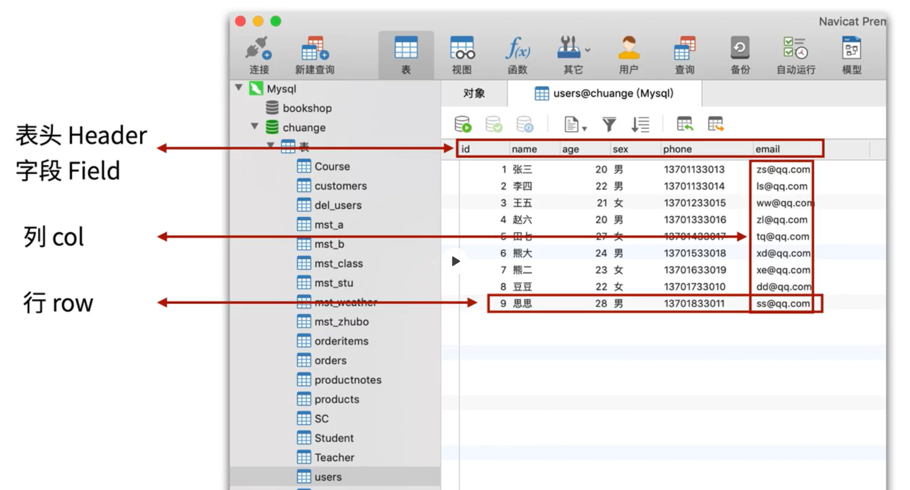
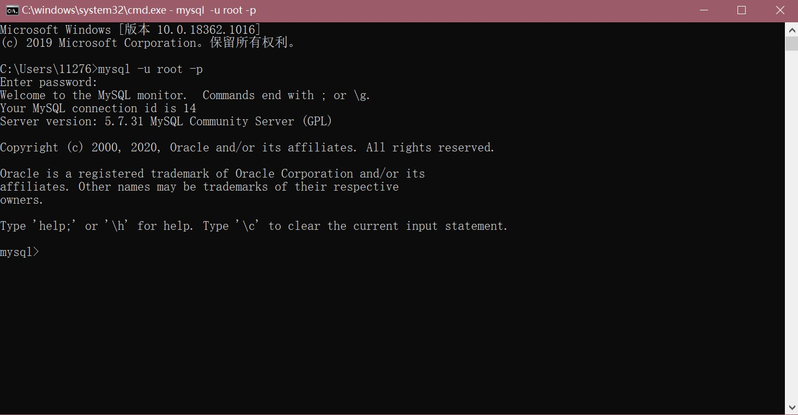
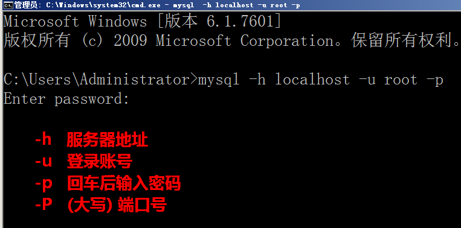
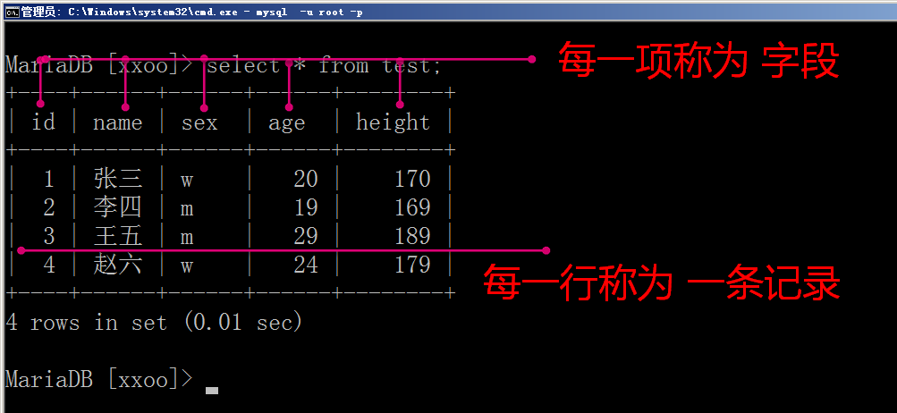
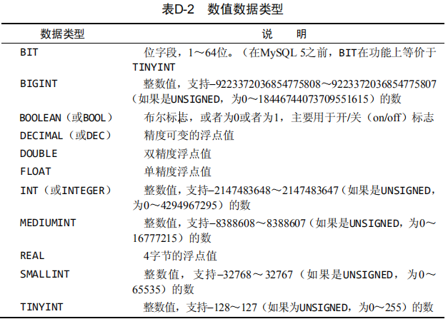
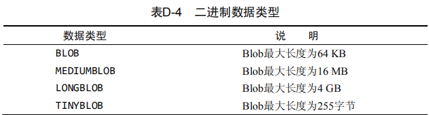

## MySQL数据库基础

### MySQL概述与基本操作

#### MySQL概述

##### 1. 什么是数据库？

```
	数据库(Database)就是按照数据结构来组织，存储和管理数据的仓库。
	专业的数据库是专门对数据进行创建，访问，管理，搜索等操作的软件，比起我们自己用文件读写的方式对数据进行管理更加的方便，快速，安全。
```

##### 2. 数据库的特点及作用

- 对数据进行持久化的保存
- 方便数据的存储和查询，速度快，安全，方便
- 可以处理并发访问
- 更加安全的权限管理访问机制

##### 3. 常见的数据库

- 关系型数据库

1. MySQL(首选，开源)
2. ORACLE DATABASE
3. PostgreSQL
4. Microsoft SQL Server

- 非关系型数据库（一般配合上述数据库使用）

1. redis(操作速度快)
2. MongoDB(文档型)

##### 4. MySQL数据库结构




#### MySQL基本操作

##### 1. MySQL安装

###### windows安装

- Windows安装MySQL5.7.31（最新为8.0.21）

- 安装步骤

- 1. 在MySQL官网 https://dev.mysql.com/downloads/mysql/ 上面下载ZIP压缩包（根据你的系统选择对应zip压缩文件）。

  2. 下载完成后解压，将其放到想要安装的目录下。例如：D:\mysql-5.7.31-winx64

  3. 新建一个my.ini配置文件，原始的my-default.ini配置文件只是个模版，不要在里面改动。
     my.ini的内容如下：

     ```ini
     [mysql] 
     # 设置mysql客户端默认的字符集
     default-character-set=utf8
     [mysqld] 
     # 设置端口为3306
     port = 3306 
     # 设置mysql的安装目录
     basedir=D:\mysql-5.7.31-winx64\
     # 设置mysql数据库的数据的存放目录（在安装目录下新建一个data文件夹）
     datadir=D:\mysql-5.7.31-winx64\data\
     # 允许最大连接数
     data max_connections=200
     # 设置服务端使用的字符集
     character-set-server=utf8
     # 创建新表时将使用的默认存储引擎
     default-storage-engine=INNODB
     # 如果你的mysql版本高于5.6.6，关于timestamp为null的时候，可能会报错。解决办法，修改配置文件的explicit_defaults_for_timestamp的值为true
     explicit_defaults_for_timestamp=true
     ```

  4. 以管理员身份运行`cmd`，进入bin目录，执行`mysqld --initialize-insecure --user=mysql`命令。不进行这一步，安装完成之后无法启动服务。

  5. 依然在管理员`cmd`窗口的bin目录下，执行`mysqld install`命令安装。完成后会提示安装成功。

  6. 依然在管理员`cmd`窗口的bin目录下，执行`net start mysql`命令启动MySQL服务。

  7. 修改环境变量，添加MySQL安装目录至系统环境变量。

  8. 在普通`cmd`窗口中，进入bin目录，执行`mysql -u root -p`命令，默认没有密码，回车进入。

  

##### 2. MySQL基本操作命令

```
使用方法:
    方式一: 通过在命令行敲命令来操作 (有助于命令的掌握)
    方式二: 通过图型界面工具,如 Navicat 等(在熟练掌握后再使用)
    方式三：通过编程语言(python,php,java,go...)执行mysql命令
```

###### SQL ( Structure query language ) 结构化查询语言

```
SQL语言分为4个部分：DDL（定义）、DML（操作）、DQL（查询）、DCL（控制）
```

###### SQL语句中的快捷键

```mysql
\G 格式化输出（文本式，竖立显示）
\s 查看服务器端信息
\c 结束命令输入操作
\q 退出当前sql命令行模式
\h 查看帮助
```

###### 操作数据库的步骤(连接, 打开库, 操作, 关闭退出)

1. 通过命令连接MySQL

   

   - 数据库语法特点

   - 1. SQL语句可以换行，要以分号结尾

        

     2. 命令不区分大小写，关键字和函数建议用大写

        

     3. 如果提示符为'>'那么需要输入一个回车

        

     4. 命令打错了换行后不能修改，可以用 \c 取消

        

2. 数据库操作

   ```mysql
   查看数据库 show databases;
   创建数据库 create database 库名 default charset=utf8mb4;
   删除数据库 drop database 库名;
   打开数据库 use 库名;
   ```

3. 数据表操作

   数据库管理系统中, 可以有很多库, 每个数据库中可以包括多张数据表

   

   

   ```mysql
   查看表: show tables;
   创建表: create table 表名(字段名1 类型,字段名2 类型)engine=innodb default charset=utf8mb4;
   创建表: 如果表不存在,则创建, 如果存在就不执行这条命令
   ```

   - **创建表: 如果表不存在,则创建, 如果存在就不执行这条命令**

     **create table if not exists 表名(字段1 类型,字段2 类型);**

     ```mysql
     create table if not exists users(
     id int not null primary key auto_increment,
     name varchar(4) not null,
     age tinyint,
     sex enum('男','女')
     )engine=innodb default charset=utf8mb4;
     ```

   - **删除表：drop table 表名**

   - **表结构：desc 表名**

   - **查看建表语句：show create table users**

4. 数据操作 增删改查

   ```mysql
   # 插入
   insert into 表名(字段1,字段2,字段3) values(值1,值2,值3);
   insert into 表名(字段1,字段2,字段3) values(a值1,a值2,a值3),(b值1,b值2,b值3);
   # 查询
   select * from 表名;
   select 字段1,字段2,字段3 from 表名;
   select * from 表名 where 字段=某个值;
   # 修改
   update 表名 set 字段=某个值 where 条件;
   update 表名 set 字段1=值1,字段2=值2 where 条件;
   update 表名 set 字段=字段+值 where 条件;
   # 删除
   delete from 表名 where 字段=某个值;
   ```

5. 退出MySQL

   `exit;或者quit;或者\q快捷键`

### 数据库与数据类型

#### 一、MySQL的数据类型

```
数据类型是定义列中可以存储什么类型的数据以及该数据实际怎样存储的基本规则
数据类型限制存储在数据列列中的数据。例如，数值数据类型列只能接受数值类型的的数据
在设计表时，应该特别重视所用的数据类型。使用错误的数据类型可能会严重地影响应用程序的功能和性能。
更改包含数据的列不是一件小事（而且这样做可能会导致数据丢失）。
数据类型：整型、浮点型、字符串、日期等
```

##### 1. 字符串数据类型

```
最常用的数据类型是串数据类型。它们存储串，如名字、地址、电话号码、邮政编码等。
不管使用何种形式的串数据类型，串值都必须括在引号内
```

有两种基本的串类型，分别为定长串和变长串：

- 定长串：char

- 1. 接受长度固定的字符串，其长度是在创建表时指定的。定长列不允许存储多于指定长度字符的数据。

  2.  指定长度后，就会分配固定的存储空间用于存放数据。

     ```mysql
     char(7) # 不管实际插入多少字符，它都会占用7个字符位置
     ```

- 变长串：varchar

  ```
  存储可变长度的字符串 varchar(7) 如果实际插入4个字符, 那么它只占4个字符位置,当然插入的数据长度不能超过7个字符。

  注意：
  	既然变长数据类型这样灵活，为什么还要使用定长数据类型？
  回答：因为性能，MySQL处理定长列远比处理变长列快得多。
  ```

- Text 变长文本类型存储

  

##### 2. 数值类型

```
数值数据类型存储数值。MySQL支持多种数值数据类型，每种存储的数值具有不同的取值范围。支持的取值范围越大，所需存储空间越多
与字符串不一样，数值不应该括在引号内
```



```mysql
decimal(5, 2) # 表示数值总共5位, 小数占2位
tinyint 1字节(8位) 0-255 ；-128，127
int 4字节。 -21亿，21亿 ；0 - 42亿
float.
# MySQL中没有专门存储货币的数据类型，一般情况下使用DECIMAL(8, 2)
```

###### 有符号或无符号

所有数值数据类型(除BIT和BOOLEAN外)都可以有符号或无符号

- 有符号数值列可以存储正或负的数值
- 无符号数值列只能存储正数
- 默认情况为有符号，但如果你知道自己不需要存储负值，可以使用UNSIGNED关键字

**注意：**

```
如果将邮政编码类似于01234存储为数值类型，则保存的将是数值1234，此时需要使用字符串类型
手机号应该用什么进行存储呢？也应该用字符串类型
```

##### 3. 日期和时间类型

```
MySQL使用专门的数据类型来存储日期和时间值
```


```mysql
datetime 8字节 1000-01-01 00:00:00 ~ 9999-12-31 23:59:59
```

##### 4. 二进制数据类型

```
二进制数据类型可存储任何数据（甚至包括二进制信息），如图像、多媒体、字处理文档等
```



#### 二、表的字段约束

- unsigned 无符号(给数值类型使用，表示为正数，不写可以表示正负数都可以)
- 字段类型后面加括号限制宽度
  - char(5). varchar(7) 在字符类型后面加限制 表示 字符串的长度
  - int(4) 没有意义，默认无符号的int为int(11)，有符号的int(10)
  - int(4) unsigned zerofill只有当给int类型设置有前导零时，设置int的宽度才有意义。
- not null 不能为空,在操作数据库时如果输入该字段的数据为NULL ，就会报错
- default 设置默认值
- primary key 主键不能为空,且唯一.一般和自动递增一起配合使用。
- auto_increment 定义列为自增属性，一般用于主键，数值会自动加1
- unique 唯一索引(数据不能重复:用户名)可以增加查询速度,但是会降低插入和更新速度

#### 三、MySQL的运算符

- 算术运算符： +、 -、 *、 /、 %

- 比较运算符： =、 >、 <、 >=、 <=、!=

- 数据库特有的比较： in、not in、is null、is not null、like、between、and

- 逻辑运算符： and、or、not

- like: 支持特殊符号%和_ ;

  `其中%表示任意数量的任意字符，_表示任意一位字符`

#### 四、主键

```
1、表中每一行都应该有可以唯一标识自己的一列，用于记录两条记录不能重复，任意两行都不具有相同的主键值
2、应该总是定义主键 虽然并不总是都需要主键，但大多数数据库设计人员都应保证他们创建的每个表具有一个主键，以便于以后的数据操纵和管理。
```

##### 要求

- 记录一旦插入到表中，主键最好不要再修改。

- 不允许NULL。

- 不在主键列中使用可能会更改的值。

  `（例如，如果使用一个名字作为主键以标识某个供应商，当该供应商合并和更改其名字时，必须更改这个主键。）`

- 自增整数类型：数据库会在插入数据时自动为每一条记录分配一个自增整数，这样我们就完全不用担心主键重复，也不用自己预先生成主键。

- 可以使用多个列作为联合主键，但联合主键并不常用。使用多列作为主键时，所有列值的组合必须是唯一的。

### DML-数据的增删改

### DQL-数据库查询SQL

### 数据库备份及授权


