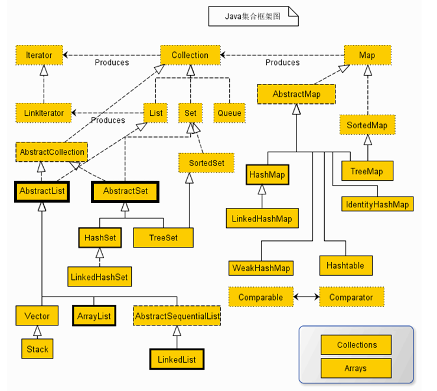
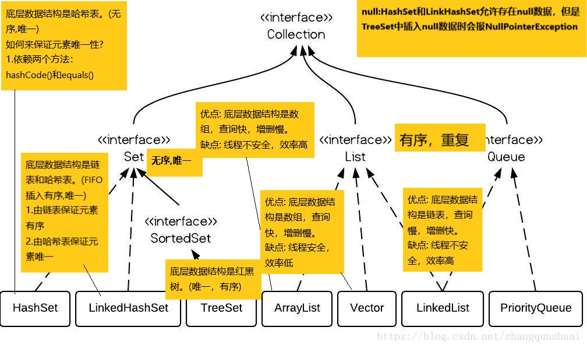
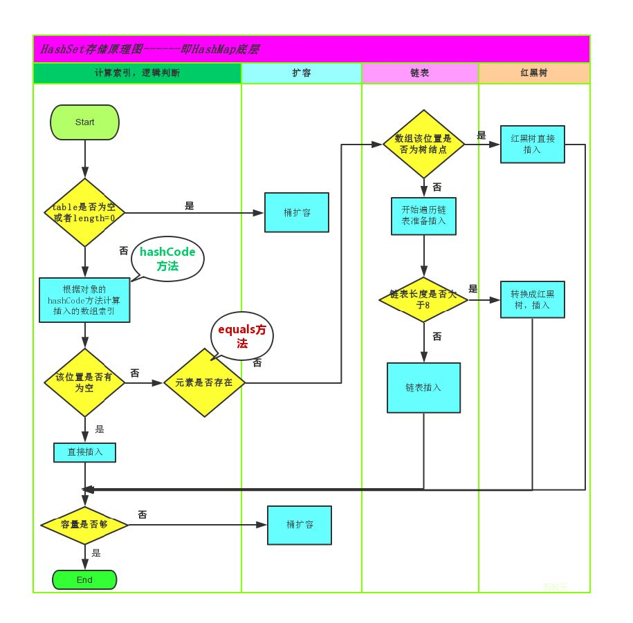
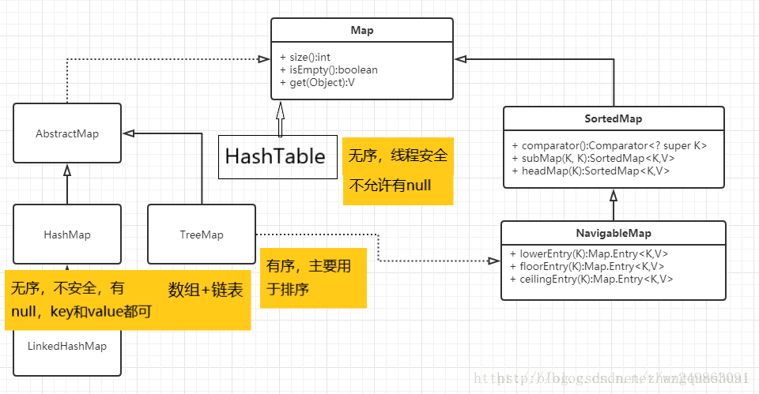

## 集合

### 数据结构

#### 常见技术结构

数据存储的常用结构有：栈、队列、数组、链表和红黑树。我们分别来了解一下：

##### 栈

- **栈(stack): **又称堆栈， 栈（stack）是限定仅在表尾进行插入和删除操作的线性表。我们把允许插入和删除的一端称为栈顶，另一端称为栈底，不含任何数据元素的栈称为空栈。栈又称为先进后出的线性表 。

简单的说：采用该结构的集合，对元素的存取有如下的特点

- 先进后出（（即，存进去的元素，要在后它后面的元素依次取出后，才能取出该元素）。例如，子弹压进弹夹，先压进去的子弹在下面，后压进去的子弹在上面，当开枪时，先弹出上面的子弹，然后才能弹出下面的子弹。
- 栈的入口、出口都是栈的顶端位置。

**压栈：**存元素

**弹栈：**取元素


##### 队列

- **队列(queue)：**,简称队， 队列是一种特殊的线性表，是运算受到限制的一种线性表，只允许在表的一端进行插入，而在另一端进行删除元素的线性表。队尾(rear)是允许插入的一端。队头(front)是允许删除的一端。空队列是不含元素的空表。

简单的说：采用该结构的集合，对元素的存取有如下的特点

- 先进先出（即，存进去的元素，要在后它前面的元素依次取出后，才能取出该元素）。例如，小火车过山洞，车头先进去，车尾后进去；车头先出来，车尾后出来。
- 队列的入口、出口各占一侧。例如，下图中的左侧为出口，右侧为出口。


##### 数组

- **数组Array：**是有序的元素序列，数组是在内存中开辟一段连续的空间，并在此空间存放元素。就像是一排出租屋，有100个房间，从001到100每个房间都有固定编号，通过编号就可以快速找到租房子的人。

简单的说,采用该结构的集合，对元素的存取有如下的特点：

- 查找元素快：通过索引，可以快速访问指定位置的元素
- 增删元素慢
  - **指定索引位置增加元素：**需要创建一个新数组，将指定新元素存储在指定索引位置，再把原数组元素根据索引，复制到新数组对应索引的位置。
  - **指定索引位置删除元素：**需要创建一个新数组，把原数组元素根据索引，复制到新数组对应索引的位置，原数组中指定索引位置元素不复制到新数组中。

#### 自定义集合类

```java
泛型：在代码中, 需要使用类型的位置 可以使用泛型 (泛指类型) ! 

使用方式：在类名后, 通过<任意大写字母>
		例如:  class MyArrayList<T> 
         在这个类中 T 表示一种类型, 一种泛指的类型, 创建对象时,有用户指定, myArrayList类中所出现的所有的T 都表示同一种类型 !

案例:

    //我们的泛型的 大写字母, 通常是类型含义的首字母
    //E:     element的首字母   : 元素
    public class MyArrayList<E> {
        /**
         * 存储数据时的数组 
         */
        private Object[] data = null;
        /**
         * 用于记录当前有效数据的长度
         */
        private int size = 0;

        public MyArrayList() {
            //默认长度为10
            data = new Object[10];
        }

        public MyArrayList(int initSize) {
            if(initSize<10) {
                initSize = 10;
            }
            data = new Object[initSize];
        }
        /**
         * 添加数据的方法
         * @param e 要添加到容器中的数据
         */
        public void add(E e) {
            //确保能存的下
            if(size == data.length) {
                //存不下 扩容后再存
                //创建一个新的数组, 长度是原数组的 约1.5倍
                Object[] temp = new Object[size+(size>>1)];
                //循环遍历旧的数组, 将旧数组中每一个下标的数据 存储到新数组的相同下标下
                for(int i=0;i<data.length;i++) {
                    temp[i] = data[i];
                }
                //使用新数组覆盖旧数组data变量
                data = temp;
            }
            //将数据存储到size下标
            data[size] = e;
            //size进行++ 
            size++;
        }
        /**
         * 用于从容器中 获取一个数据
         * @param index 数据的下标
         * @return 数据
         */
        public E get(int index) {
            return (E)data[index];
        }
        /**
         * 用于从容器中移除一个数据的方法
         * @param index 要移除的数据的下标
         * @return 被移除的数据 , 数据不存在的话 返回null
         */
        public E remove(int index) {
            E e = (E) data[index];
            for(int i=index;i<size-1;i++) {
                data[i] = data[i+1];
            }
            data[size-1] = null;
            size--;
            return e;
        }

        public void printAll() {
            for (int i = 0; i < size; i++) {
                System.out.println(data[i]);
            }
        }
        /**
         * 用于获取当前容器中 有效的数据个数
         * @return
         */
        public int size() {
            return this.size;
        }
    }
```

#### Collection集合

##### 概述

- **集合**是Java中提供的一种容器，可以用来存储多个数据。

集合和数组既然都是容器，他们有啥区别?

- 数组的长度是固定的。集合的长度是可变的。
- 数组中存储的是同一类型的元素，可以存储基本数据类型值。集合存储的都是对象。而且对象的类型可以不一致。在开发中一般当对象多的时候，使用集合进行存储。

##### 集合框架

JAVASE提供了满足各种需求的API，在使用这些API前，先了解其继承与接口操作架构，才能了解何时采用哪个类，以及类之间如何彼此合作，从而达到灵活应用。

集合按照其存储结构可以分为两大类，分别是单列集合 java.util.Collection 和双列集合
java.util.Map 。



- **Collection：**单列集合类的根接口，用于存储一系列符合某种规则的元素，它有两个重要的子接口，分别是`java.util.List`和`java.util.Set`。其中List 的特点是元素有序、元素可重复。 Set 的特点是元素无序，而且不可重复。 List 接口的主要实现类有`java.util.ArrayList`和`java.util.LinkedList`，`Set`接口的主要实现类有`java.util.HashSet`和`java.util.TreeSet`。

  - 面试题：Collection与Collections的区别？

    ```
    这两个东西, 没有可比性 : 
        Collection  表示的是 集合 单值存储的最大父接口
        而Collections 是一个用于 操作各种集合的工具 !
    ```

  - **Collection**常用功能

    Collection是所有单列集合的父接口，因此在Collection中定义了单列集合(List和Set)通用的一些方法，
    这些方法可用于操作所有的单列集合。方法如下：

    ```java
    public boolean add(E e): 把给定的对象添加到当前集合中。
    public void clear()：清空集合中所有元素。
    public boolean remove(E e)：把给定的对象在当前集合中删除。
    public boolean contains(E e)：判断当前集合中是否包含给定的对象。
    public boolean isEmpty()：判断当前集合是否为空。
    public int size()：返回集合中元素的个数。
    public Object[] toArrary()：把集合中的元素，存储到数组中。
    ```



### List集合

#### Collection子接口List

```
java.util.List 接口继承自 Collection 接口，是单列集合的一个重要分支，习惯性地会将实现了List 接口的对象称为List集合。在List集合中允许出现重复的元素，所有的元素是以一种线性方式进行存储的，在程序中可以通过索引来访问集合中的指定元素。另外，List集合还有一个特点就是元素有序，即元素的存入顺序和取出顺序一致。
总结：
	List接口特点：
		1. 它是一个元素存取有序的集合。例如，存元素的顺序是11、22、33。那么集合中，元素的存储就是按照				11、22、33的顺序完成的）。
         2. 它是一个带有索引的集合，通过索引就可以精确的操作集合中的元素（与数组的索引是一个道理）。
         3. 集合中可以有重复的元素，通过元素的equals方法，来比较是否为重复的元素。
```

#### 常用方法

| 变量和类型 | 方法                                                   | 描述                                           |
| ---------- | ------------------------------------------------------ | ---------------------------------------------- |
| void       | [add(int index,E element)](#add(int index, E element)) | 将指定元素插入此列表中的指定位置（可选操作）。 |
| boolean    | [add(E e)](#add(E e))                                  | 将指定元素追加到此列表的末尾                   |
| E          | [set(int index, E element)](#set)                      | 用指定的元素替换此列表中指定位置的元素         |
| E          | [get(int index)](#get)                                 | 返回此列表中指定位置的元素                     |
| E          | [remove(int index)](#remove)                           | 删除此列表中指定位置的元素                     |
| boolean    | [contains(Object o)](#contains)                        | 如果此列表包含指定的元素，则返回`true`         |
| int        | [size()](#size)                                        | 返回此列表的元素数                             |
| void       | [clear()](#clear)                                      | 从此列表中删除所有元素                         |

#### 常用方法详细信息

##### add(int index, E element)

```java
void add(int index, E element)
	将指定元素插入此列表中的指定位置。 将当前位置的元素（如果有）和任何后续元素向右移动（将其添加到索引中）。 
参数： 
	index - 要插入指定元素的索引 
	element - 要插入的元素 
```

##### add(E e)

```java
boolean add(E e)
	将指定的元素追加到此列表的末尾。 
	支持此操作的列表可能会限制可能添加到此列表的元素。 特别是，某些列表将拒绝添加null元素，而其他列表将对可能添加的元素类型施加限制。 列表类应在其文档中明确指出可以添加哪些元素的任何限制。 

参数：
e - 要附加到此列表的元素 
```

##### set

```java
E set(int index, E element)
    用指定的元素替换此列表中指定位置的元素（可选操作）。 
参数：
	index - 要替换的元素的索引 
	element - 要存储在指定位置的元素 
结果：
	先前在指定位置的元素
```

##### get

```java
E get(int index)
	返回此列表中指定位置的元素。 
参数：
	index - 要返回的元素的索引 
结果：
	此列表中指定位置的元素 
```

##### remove

```java
E remove(int index)
    删除此列表中指定位置的元素（可选操作）。 将任何后续元素向左移位（从索引中减去一个元素）。 返回从列表中删除的元素。 
参数：
	index - 要删除的元素的索引 
结果：
	先前在指定位置的元素 
```

##### contains

```java
boolean contains(Object o)
	如果此列表包含指定的元素，则返回true 。 更正式地说，返回true当且仅当此列表包含至少一个元素e ，使得Objects.equals(o, e) 。
参数:
	o - 要测试其在此列表中的存在的元素 
结果:
	true如果此列表包含指定的元素 
```

#### ArrayList集合

```java
java.util.ArrayList 集合数据存储的结构是数组结构。元素增删慢，查找快，由于日常开发中使用最多的功能为查询数据、遍历数据，所以 ArrayList 是最常用的集合。

特性:
    1.  来自JDK的1.2版本
    2.  内部是数组的实现。更利于: 数据的查找、数据的遍历。
    3.  默认的初始容量 是 10
    4.  扩容算法: 原长度+原长度右移一位 (扩容的新长度大约为原长度的1.5倍)
    5.  可以存储null
    6.  允许存储重复的数据
    7.  线程不安全但效率高
    
构造方法:
    -   ArrayList()
            创建一个默认长度为0的集合, 在第一次使用时 会自动扩容为10长度。

    -   ArrayList(int initSize)
            创建一个默认长度为指定数值的 集合。

    -   ArrayList(Collection coll);
            通过一个单值存储的集合, 创建一个ArrayList。

ArraryList是List的子类，List中的方法ArraryList都是可以使用。
```

##### 面试题

```
//观察代码, 描述执行结果:
    ArrayList data = new ArrayList();
    data.add(1);
    data.add(2);
    data.add(3);
    data.add(4);
    data.remove(2);
    System.out.println(data);
    //问打印的结果是: 

    //  此题的疑点:  remove方法存在方法的重载, 可以传入要删除的数据 或 要删除的下标
    //          疑点就是 这个集合通过数据 可以删除 数据2.
    //          通过下标 可以删除下标为2的 数据3
    //  其实面试题问的就是, 到底删除了数据2  还是数据3:
    //  答:  删除的是 下标2的数据3
    //  原因: 
    //      集合的泛型为未指定, 表示为Object 
    //      存储int类型时, 其实发生了自动装箱, 也就是其实集合中并未存储任何int , 存储的都是Integer
    //      当我们传入一个int类型的数据 要调用remove方法时.  调用的就是参数为int的remove方法,  也就是按照下标删除的方法/
    //      如果我们传入的是Integer类型的参数, 则会调用参数为Object的remove方法, 按照数据进行删除 !
```

#### LinkedList集合

```java
内部使用了双链表结构实现。
线程不安全,效率较高
因为内部是链表, 所以更方便数据的删除 与 插入 , 但是不利于数据的查找与遍历。

构造方法:
    -   ArrayList()
            创建一个默认长度为0的集合,  链表实现的.

    -   ArrayList(Collection coll);
            通过一个单值存储的集合, 创建一个ArrayList
            
实际开发中对一个集合元素的添加与删除经常涉及到首尾操作，而LinkedList提供了大量首尾操作的方法。
方法如下：
    public void addFirst(E e) :将指定元素插入此列表的开头。
    public void addLast(E e) :将指定元素添加到此列表的结尾。
    public E getFirst() :返回此列表的第一个元素。
    public E getLast() :返回此列表的最后一个元素。
    public E removeFirst() :移除并返回此列表的第一个元素。
    public E removeLast() :移除并返回此列表的最后一个元素。
    public E pop() :从此列表所表示的堆栈处弹出一个元素。
    public void push(E e) :将元素推入此列表所表示的堆栈。
    public boolean isEmpty() ：如果列表不包含元素，则返回true。
    
LinkedList是List的子类，List中的方法LinkedList都是可以使用。在开发时，LinkedList集合也可以作为堆栈，队列的结构使用。
```

#### Vector集合

```
很多时候 我们提到Vector 不是为了使用它, 而是为了拿它跟ArrayList进行对比。

整个集合体系, 是在JDK1.2版本整合的。而Vector是JDK1.0版本就出现的. 在1.2版本时被移动到了集合体系中。
可以理解为早期版本的ArrayList。

与ArrayList不同的点:
    1.  Vector线程安全 , ArrayList线程非安全
    2.  Vector扩容算法：由用户指定扩容的增量, 每次扩容为 原长度+增量。如果未指定增量 或 增量为0。则每次扩容为两倍。
        ArrayList扩容算法:  原长度+原长度右移一位。
```

#### List集合实现类的应用场景

```
强调：以后开发时, 通常情况下(99%) 我们使用的List集合都是ArrayList !

ArrayList：大量遍历与查找的操作
Vector：线程安全时, 进行大量的遍历与查找操作
LinkedList：大量的 插入与删除的操作
```

### Set集合

```
java.util.Set 接口和 java.util.List 接口一样，同样继承自Collection 接口，它与Collection 接口中的方法基本一致，并没有对Collection 接口进行功能上的扩充，只是比Collection 接口更加严格了。与List 接口不同的是，Set 接口中元素无序，并且都会以某种规则保证存入的元素不出现重复。
Set 集合有多个子类，重点了解java.util.HashSet 、java.util.LinkedHashSet 这两个集合。
```

#### HashSet集合

```
java.util.HashSet 是 Set 接口的一个实现类，它所存储的元素是不可重复的，并且元素都是无序的 (即存取顺序不一致)。java.util.HashSet 底层的实现其实是一个java.util.HashMap 支持。
HashSet 是根据对象的哈希值来确定元素在集合中的存储位置，因此具有良好的存取和查找性能。保证元素唯一性的方式依赖于： hashCode 与 equals 方法。
```

我们先来使用一下Set集合存储，看下现象：

```java
public class HashSetDemo {
	public static void main(String[] args) {
		//创建 Set集合
		HashSet<String> set = new HashSet<String>();
        //添加元素
        set.add(new String("123"));
        set.add("123");
        set.add("123");
        set.add("321");
        //遍历
        for (String name : set) {
        	System.out.println(name);
        }
	}
}

输出结果：
123
321
```

##### HashSet集合存储数据的结构（哈希表）

```
什么是哈希表呢？

	在JDK1.8之前，哈希表底层采用数组+链表实现，即使用链表处理冲突，同一hash值的链表都存储在一个链表里。但是当位于一个桶中的元素较多，即hash值相等的元素较多时，通过key值依次查找的效率较低。而JDK1.8中，哈希表存储采用数组+链表+红黑树实现，当链表长度超过阈值（8）时，将链表转换为红黑树，这样大大减少了查找时间。
```

简单的来说，哈希表是由数组+链表+红黑树（**JDK1.8**增加了红黑树部分）实现的，如下图所示。




总而言之，**JDK1.8**引入红黑树大程度优化了HashMap的性能，那么对于我们来讲保证HashSet集合元素的唯一，其实就是根据对象的hashCode和equals方法来决定的。如果我们往集合中存放自定义的对象，那么保证其唯一，就必须复写hashCode和equals方法建立属于当前对象的比较方式。

##### HashSet存储自定义类型元素

```
给HashSet中存放自定义类型元素时，需要重写对象中的hashCode和equals方法，建立自己的比较方式，才能保证HashSet集合中的对象唯一。
```

#### LinkedHashSet

```
我们知道HashSet保证元素唯一，可是元素存放进去是没有顺序的，那么我们要保证有序，怎么办呢？在HashSet下面有一个子类 java.util.LinkedHashSet ，它是链表和哈希表组合的一个数据存储结构。
```

#### TreeSet

```java
与 HashSet 不同的是，TreeSet 本身属于排序的子类，此类的定义如下：
public class TreeSet<E> extends AbstractSet<E>
implements NavigableSet<E>, Cloneable, Serializable

下面通过代码来观察其是如何进行排序的:
public class TreeSetDemo {
    public static void main(String[] args) {
        Set<String> all = new TreeSet<String>(); // 实例化Set接口对象\
        all.add("D");
        all.add("X");
        all.add("A");
        System.out.println(all);
	}
}

输出结果：
[A, D, X]
虽然在增加元素的时候属于无序操作，但是增加后却为可以为用户进行排序功能的实现。

注意：
	关于 TreeSet 的排序实现，如果是集合中对象是自定义的或者说其他系统定义的类没有实现
Comparable 接口，则不能实现 TreeSet 的排序，会报类型转换（转向 Comparable 接口）错误。换句话说要添加到 TreeSet 集合中的对象的类型必须实现了 Comparable 接口。

	不过 TreeSet 的集合因为借用了 Comparable 接口，同时可以去除重复值，而 HashSet 虽然是Set 接口子类，但是对于没有复写 Object 的 equals 和 hashCode 方法的对象，加入了 HashSet集合中也是不能去掉重复值的。
```

### Iterator迭代器

```
已经学习过了基本的集合操作，那么对于集合的输出本身也是有多种形式的，可以使用如下的几种方式：
	Iterator 迭代输出（90%）、ListIterator（5%）、Enumeration（1%）、foreach（4%）
但是在讲解输出的时候一定要记住以下的原则：“只要是碰到了集合，则输出的时候想都不想就使用 Iterator 进行输出。”
```

#### Iterator接口

```
在程序开发中，经常需要遍历集合中的所有元素。针对这种需求，JDK专门提供了一个接口java.util.Iterator 。Iterator 接口也是Java集合中的一员，但它与 Collection 、 Map 接口有所不同， Collection 接口与 Map 接口主要用于存储元素，而 Iterator 主要用于迭代访问（即遍历）Collection 中的元素，因此 Iterator 对象也被称为迭代器。
```

想要遍历Collection集合，那么就要获取该集合迭代器完成迭代操作，下面介绍一下获取迭代器的方法：

- `public Iterator iterator():`获取集合对应的迭代器，用来遍历集合中的元素。

**迭代**的概念：

- **迭代：**即Collection集合元素的通用获取方式。在取元素之前先要判断集合中有没有元素，如果有，就把这个元素取出来，继续在判断，如果还有就再取出出来。一直把集合中的所有元素全部取出。这种取出方式专业术语称为迭代。

##### 常用方法

| 变量和类型   | 方法                  | 描述                                   |
| ------------ | --------------------- | -------------------------------------- |
| boolean      | [hasNext()](#hasNext) | 如果迭代具有更多元素，则返回 `true` 。 |
| E            | [next()](#next)       | 返回迭代中的下一个元素。               |
| default void | [remove()](#remove)   | 删除当前元素                           |

#### 迭代器实现原理

```
我们在之前案例已经完成了Iterator遍历集合的整个过程。当遍历集合时，首先通过调用 T 集合的iterator()方法获得迭代器对象，然后使用hashNext()方法判断集合中是否存在下一个元素，如果存在，则调用next()方法将元素取出，否则说明已到达了集合末尾，停止遍历元素。
```

#### 增强for

```java
增强for循环(也称for each循环)是JDK1.5以后出来的一个高级for循环，专门用来遍历数组和集合的。它的内部原理其实是个Iterator迭代器，所以在遍历的过程中，不能对集合中的元素进行增删操作。

格式：
	for(元素的数据类型 变量 : Collection集合or数组){
		//写操作代码
	}
```

### Collections

```
此类仅包含对集合进行操作或返回集合的静态方法。 它包含对集合进行操作的多态算法，“包装器”，它返回由指定集合支持的新集合，以及其他一些可能性和结束。
```

#### 常用方法

- `public static  boolean addAll(Collection c, T... elements)` ：往集合中添加一些元素。
- `public static void shuffle(List list)`： 打乱集合顺序。
- `public static  void sort(List list)` ：将集合中元素按照默认规则排序。
- `public static  void sort(List list，Comparator )` ：将集合中元素按照指定规则排序

#### Comparator比较器

```java
说到排序了，简单的说就是两个对象之间比较大小，那么在JAVA中提供了两种比较实现的方式，一种是比较死板的采用 java.lang.Comparable 接口去实现，一种是灵活的当我需要做排序的时候在去选择的 java.util.Comparator 接口完成。

那么我们采用的 public static <T> void sort(List<T> list) 这个方法完成的排序，实际上要求了被排序的类型需要实现Comparable接口完成比较的功能，在String类型上如下：

public  final class String implements java.io.Serializable, Comparable<String>, CharSequence

String类实现了这个接口，并完成了比较规则的定义，但是这样就把这种规则写死了，那比如我想要字符串按照第一个字符降序排列，那么这样就要修改String的源代码，这是不可能的了。
那么这个时候我们可以使用public static <T> void sort(List<T> list，Comparator<? super T> ) 方法灵活的完成，这个里面就涉及到了Comparator这个接口，位于位于java.util包下，排序是comparator能实现的功能之一,该接口代表一个比较器，比较器具有可比性！顾名思义就是做排序的，通俗地讲需要比较两个对象谁排在前谁排在后，那么比较的方法就是：

public int compare(String o1, String o2) : 比较其两个参数的顺序。
    两个对象比较的结果有三种：大于，等于，小于。
    如果要按照升序排序，
    则o1 小于o2，返回（负数），相等返回0，01大于02返回（正数）
    如果要按照降序排序
    则o1 小于o2，返回（正数），相等返回0，01大于02返回（负数）

操作如下：
public class CollectionsDemo3 {
    public static void main(String[] args) {
        ArrayList<String> list = new ArrayList<String>();
        list.add("cba");
        list.add("aba");
        list.add("sba");
        list.add("nba");
        //排序方法 按照第一个单词的降序
        Collections.sort(list, new Comparator<String>() {
            @Override
            public int compare(String o1, String o2) {
            	return o2.charAt(0) - o1.charAt(0);
            }
        });
        System.out.println(list);
    }
}

输出结果：
[sba, nba, cba, aba]
```

#### 简述Comparable和Comparator两个接口的区别

- **Comparable：**强行对实现它的每个类的对象进行整体排序。这种排序被称为类的自然排序，类的compareTo方法被称为它的自然比较方法。只能在类中实现compareTo()一次，不能经常修改类的代码实现自己想要的排序。实现此接口的对象列表（和数组）可以通过Collections.sort（和Arrays.sort）进行自动排序，对象可以用作有序映射中的键或有序集合中的元素，无需指定比较器。
- **Comparator：**强行对某个对象进行整体排序。可以将Comparator 传递给sort方法（如Collections.sort或 Arrays.sort），从而允许在排序顺序上实现精确控制。还可以使用Comparator来控制某些数据结构（如有序set或有序映射）的顺序，或者为那些没有自然顺序的对象collection提供排序。

### Map集合

```
将键映射到值的对象。Map不能包含重复的键; 每个键最多可以映射一个值。 
```

#### 常用方法

- `void clear()：` 清空Map 集合中的内容
- `boolean containsKey(Object key)`：判断集合中是否存在指定的key
- `boolean containsValue(Object value)`：判断集合中是否存在指定的value
- `Set<Map.Entry<K,V>> entrySet()`: 将Map 接口变为Set 集合
- `V get(Object key)`: 根据key 找到其对应的value
- `boolean isEmpty()`: 判断是否为空
- `Set<K> keySet()`: 将全部的key 变为Set 集合
- `Collection<V> values()`: 将全部的value 变为Collection 集合
- `V put(K key,V value)`: 向集合中增加内容
- `void putAll(Map<? extends K,? extends V> m)`: 增加一组集合
- `V remove(Object key)`: 根据key 删除内容

#### Map集合结构

- 


#### HashMap

```
基于哈希表的Map接口的实现。 此实现提供了所有可选的映射操作，并允许null值和null键。（ HashMap类大致相当于Hashtable ，除了它是不同步的并且允许空值。）此类不保证存放的顺序; 特别是，它不保证订单会随着时间的推移保持不变。 
```

##### 构造方法

| 构造器      | 描述                                                        |
| ----------- | ----------------------------------------------------------- |
| `HashMap()` | 使用默认初始容量(16)和默认加载因子(0.75)构造一个空HashMap。 |

##### 常用方法

| 变量和类型 | 方法                        | 描述                                                         |
| ---------- | --------------------------- | ------------------------------------------------------------ |
| V          | [put(K key, V value)](#put) | 将指定的值与此映射中指定的键相关联。                         |
| V          | [get(Object key)](#get)     | 返回指定键映射到的值，如果此映射不包含键的映射，则返回null。 |
| Set<K>     | [keySet()](keySet)          | 返回此映射中包含的键的Set视图。                              |

##### 案例

```java
//向集合中增加内容
public class HashMapDemo1 {
    public static void main(String[] args) {
        Map<Integer, String> map = new HashMap<>();
        map.put(1, "张三A");
        map.put(1, "张三B"); // 新的内容替换掉旧的内容
        map.put(2, "李四");
        map.put(3, "王五");
        String val = map.get(1);
        System.out.println(val);
    }
}
结果：
	张三B

//得到全部的Key或Value
public class HashMapDemo2 {
    public static void main(String[] args) {
        HashMap<Integer, String> map = new HashMap<>();
        map.put(1, "张三A");
        map.put(2, "李四");
        map.put(3, "王五");
        Set<Integer> set = map.keySet(); // 得到全部的key
        Collection<String> value = map.values(); // 得到全部的value
        Iterator<Integer> iter1 = set.iterator();
        Iterator<String> iter2 = value.iterator();
        System.out.print("全部的key：");
        while (iter1.hasNext()) {
        	System.out.print(iter1.next() + "、");
        }
        System.out.print("\n全部的value：");
        while (iter2.hasNext()) {
        	System.out.print(iter2.next() + "、");
        }
    }
}
结果：
	全部的key：1、2、3、
	全部的value：张三A、李四、王五、

//循环输出Map中全部内容
public class HashMapDemo3 {
    public static void main(String[] args) {
        HashMap<String, String> map = new HashMap<String, String>();
        map.put("ZS", "张三");
        map.put("LS", "李四");
        map.put("WW", "王五");
        map.put("ZL", "赵六");
        map.put("SQ", "孙七");
        Set<String> set = map.keySet(); // 得到全部的key
        Iterator<String> iter = set.iterator();
        while (iter.hasNext()) {
            String i = iter.next(); // 得到key
            System.out.println(i + " --:> " + map.get(i));
        }
    }
}
结果：
    WW --:> 王五
    ZL --:> 赵六
    LS --:> 李四
    ZS --:> 张三
    SQ --:> 孙七
```

#### Hashtable

```
Hashtable 是一个最早的 key - value 的操作类，本身是在 JDK 1.0 的时候推出的。其基本操作与 HashMap 是类似的。
操作的时候，可以发现与 HashMap 基本上没有什么区别，而且本身都是以 Map 为操作标准的，所以操作的结果形式。
都一样。但是 Hashtable 中是不能向集合中插入 null 值的。
```

##### 案例

```java
public class HashtableDemo1 {
    public static void main(String[] args) {
        Map<String, Integer> numbers = new Hashtable<>();
        numbers.put("one", 1);
        numbers.put("two", 2);
        numbers.put("three", 3);
        Integer n = numbers.get("two");
        if (n != null) {
        	System.out.println("two = " + n);
        }
    }
}
结果:
	two = 2
```

#### HashMap与Hashtable的区别

|  区别点  |          HashMap           |            Hashtable             |
| :------: | :------------------------: | :------------------------------: |
| 推出时间 | JDK1.2之后推出，新的操作类 |     JDK1.0时推出，旧的操作类     |
|   性能   |     异步处理，性能较高     |        同步处理，性能较低        |
|   null   |        允许设置null        | 不允许设置，分则会出现空指针异常 |

#### TreeMap

```
TreeMap 子类是允许 key 进行排序的操作子类，其本身在操作的时候将按照 key 进行排序，另外，key 中的内容可以为任意的对象，但是要求对象所在的类必须实现 Comparable 接口。
```

#### Map集合输出

```
	在 Collection 接口中，可以使用 iterator()方法为 Iterator 接口实例化，并进行输出操作，但是在 Map 接口中并没有此方法的定义，所以 Map 接口本身是不能直接使用 Iterator 进行输出的。
	因为 Map 接口中存放的每一个内容都是一对值，而使用 Iterator 接口输出的时候，每次取出的都实际上是一个完整的对象。如果此时非要使用 Iterator 进行输出的话，则可以按照如下的步骤进行：
    1、 使用 Map 接口中的 entrySet()方法将 Map 接口的全部内容变为 Set 集合
    2、 可以使用 Set 接口中定义的 iterator()方法为 Iterator 接口进行实例化
    3、 之后使用 Iterator 接口进行迭代输出，每一次的迭代都可以取得一个 Map.Entry 的实例
	4、 通过 Map.Entry 进行 key 和 value 的分离
	
	Map.Entry 本身是一个接口。此接口是定义在 Map 接口内部的，是 Map 的内部接口。此内部接口使用 static 进行定义，所以此接口将成为外部接口。
	实际上来讲，对于每一个存放到 Map 集合中的 key 和 value 都是将其变为了 Map.Entry 并且将 Map.Entry 保存在了Map 集合之中。
```


##### 案例

```java
//使用Iterator输出Map
public class MapOutDemo1 {
    public static void main(String[] args) {
        Map<String, String> map = new HashMap<>();
        map.put("ZS", "张三");
        map.put("LS", "李四");
        map.put("WW", "王五");
        map.put("ZL", "赵六");
        map.put("SQ", "孙七");
        Set<Map.Entry<String, String>> set = map.entrySet();// 变为Set实例
        Iterator<Map.Entry<String, String>> iter = set.iterator();
        while (iter.hasNext()) {
        	Map.Entry<String, String> me = iter.next();
        	System.out.println(me.getKey() + " --> " + me.getValue());
    	}
	}
}
结果：
	WW --> 王五
	ZL --> 赵六
	LS --> 李四
	ZS --> 张三
	SQ --> 孙七

//JDK1.5之后可以使用foreach
public class MapOutDemo2 {
    public static void main(String[] args) {
        Map<String, String> map = new HashMap<>();
        map.put("ZS", "张三");
        map.put("LS", "李四");
        map.put("WW", "王五");
        map.put("ZL", "赵六");
        map.put("SQ", "孙七");
        for (Map.Entry<String, String> me : map.entrySet()) {
        	System.out.println(me.getKey() + " --> " + me.getValue());
        }
    }
}

结果：
	WW --> 王五
	ZL --> 赵六
	LS --> 李四
	ZS --> 张三
	SQ --> 孙七
```