## MySQL数据库基础

### MySQL概述与基本操作

#### MySQL概述

##### 1. 什么是数据库？

```
	数据库(Database)就是按照数据结构来组织，存储和管理数据的仓库。
	专业的数据库是专门对数据进行创建，访问，管理，搜索等操作的软件，比起我们自己用文件读写的方式对数据进行管理更加的方便，快速，安全。
```

##### 2. 数据库的特点及作用

- 对数据进行持久化的保存
- 方便数据的存储和查询，速度快，安全，方便
- 可以处理并发访问
- 更加安全的权限管理访问机制

##### 3. 常见的数据库

- 关系型数据库

1. MySQL(首选，开源)
2. ORACLE DATABASE
3. PostgreSQL
4. Microsoft SQL Server

- 非关系型数据库（一般配合上述数据库使用）

1. redis(操作速度快)
2. MongoDB(文档型)

##### 4. MySQL数据库结构


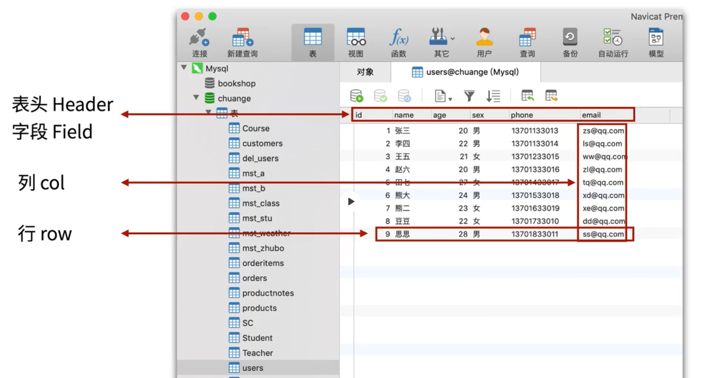

#### MySQL基本操作

##### 1. MySQL安装

###### windows安装

- Windows安装MySQL5.7.31（最新为8.0.21）

- 安装步骤

- 1. 在MySQL官网 https://dev.mysql.com/downloads/mysql/ 上面下载ZIP压缩包（根据你的系统选择对应zip压缩文件）。

  2. 下载完成后解压，将其放到想要安装的目录下。例如：D:\mysql-5.7.31-winx64

  3. 新建一个my.ini配置文件，原始的my-default.ini配置文件只是个模版，不要在里面改动。
     my.ini的内容如下：

     ```ini
     [mysql] 
     # 设置mysql客户端默认的字符集
     default-character-set=utf8
     [mysqld] 
     # 设置端口为3306
     port = 3306 
     # 设置mysql的安装目录
     basedir=D:\mysql-5.7.31-winx64\
     # 设置mysql数据库的数据的存放目录（在安装目录下新建一个data文件夹）
     datadir=D:\mysql-5.7.31-winx64\data\
     # 允许最大连接数
     data max_connections=200
     # 设置服务端使用的字符集
     character-set-server=utf8
     # 创建新表时将使用的默认存储引擎
     default-storage-engine=INNODB
     # 如果你的mysql版本高于5.6.6，关于timestamp为null的时候，可能会报错。解决办法，修改配置文件的explicit_defaults_for_timestamp的值为true
     explicit_defaults_for_timestamp=true
     ```

  4. 以管理员身份运行`cmd`，进入bin目录，执行`mysqld --initialize-insecure --user=mysql`命令。不进行这一步，安装完成之后无法启动服务。

  5. 依然在管理员`cmd`窗口的bin目录下，执行`mysqld install`命令安装。完成后会提示安装成功。

  6. 依然在管理员`cmd`窗口的bin目录下，执行`net start mysql`命令启动MySQL服务。

  7. 修改环境变量，添加MySQL安装目录至系统环境变量。

  8. 在普通`cmd`窗口中，进入bin目录，执行`mysql -u root -p`命令，默认没有密码，回车进入。

  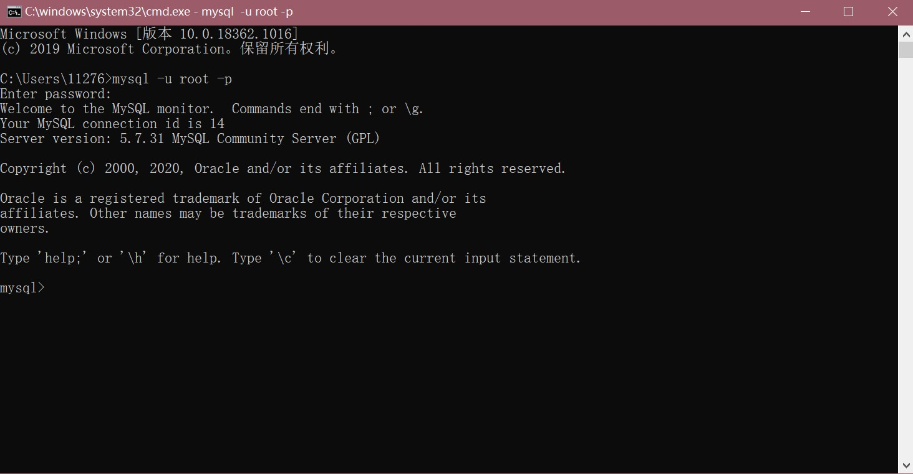

##### 2. MySQL基本操作命令

```
使用方法:
    方式一: 通过在命令行敲命令来操作 (有助于命令的掌握)
    方式二: 通过图型界面工具,如 Navicat 等(在熟练掌握后再使用)
    方式三：通过编程语言(python,php,java,go...)执行mysql命令
```

###### SQL ( Structure query language ) 结构化查询语言

```
SQL语言分为4个部分：DDL（定义）、DML（操作）、DQL（查询）、DCL（控制）
```

###### SQL语句中的快捷键

```mysql
\G 格式化输出（文本式，竖立显示）
\s 查看服务器端信息
\c 结束命令输入操作
\q 退出当前sql命令行模式
\h 查看帮助
```

###### 操作数据库的步骤(连接, 打开库, 操作, 关闭退出)

1. 通过命令连接MySQL

   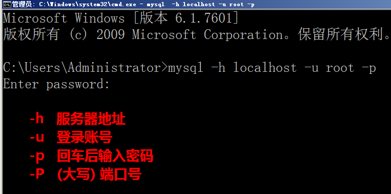

   - 数据库语法特点

   - 1. SQL语句可以换行，要以分号结尾

        

     2. 命令不区分大小写，关键字和函数建议用大写

        

     3. 如果提示符为'>'那么需要输入一个回车

        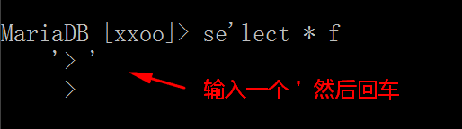

     4. 命令打错了换行后不能修改，可以用 \c 取消

        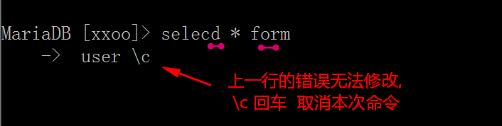

2. 数据库操作

   ```mysql
   查看数据库 show databases;
   创建数据库 create database 库名 default charset=utf8mb4;
   删除数据库 drop database 库名;
   打开数据库 use 库名;
   ```

3. 数据表操作

   数据库管理系统中, 可以有很多库, 每个数据库中可以包括多张数据表

   

   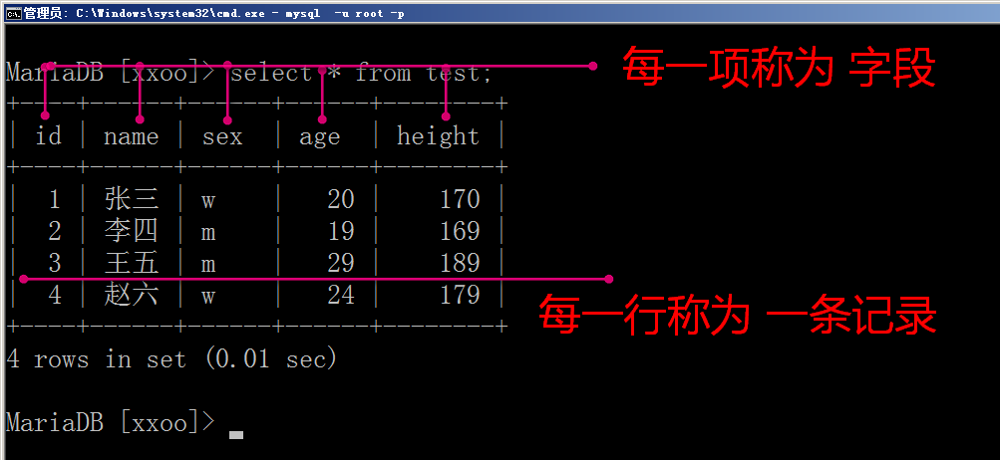

   ```mysql
   查看表: show tables;
   创建表: create table 表名(字段名1 类型,字段名2 类型)engine=innodb default charset=utf8mb4;
   创建表: 如果表不存在,则创建, 如果存在就不执行这条命令
   ```

   - **创建表: 如果表不存在,则创建, 如果存在就不执行这条命令**

     **create table if not exists 表名(字段1 类型,字段2 类型);**

     ```mysql
     create table if not exists users(
     id int not null primary key auto_increment,
     name varchar(4) not null,
     age tinyint,
     sex enum('男','女')
     )engine=innodb default charset=utf8mb4;
     ```

   - **删除表：drop table 表名**

   - **表结构：desc 表名**

   - **查看建表语句：show create table users**

4. 数据操作 增删改查

   ```mysql
   # 插入
   insert into 表名(字段1,字段2,字段3) values(值1,值2,值3);
   insert into 表名(字段1,字段2,字段3) values(a值1,a值2,a值3),(b值1,b值2,b值3);
   # 查询
   select * from 表名;
   select 字段1,字段2,字段3 from 表名;
   select * from 表名 where 字段=某个值;
   # 修改
   update 表名 set 字段=某个值 where 条件;
   update 表名 set 字段1=值1,字段2=值2 where 条件;
   update 表名 set 字段=字段+值 where 条件;
   # 删除
   delete from 表名 where 字段=某个值;
   ```

5. 退出MySQL

   `exit;或者quit;或者\q快捷键`

### 数据库与数据类型

#### 一、MySQL的数据类型

```
数据类型是定义列中可以存储什么类型的数据以及该数据实际怎样存储的基本规则
数据类型限制存储在数据列列中的数据。例如，数值数据类型列只能接受数值类型的的数据
在设计表时，应该特别重视所用的数据类型。使用错误的数据类型可能会严重地影响应用程序的功能和性能。
更改包含数据的列不是一件小事（而且这样做可能会导致数据丢失）。
数据类型：整型、浮点型、字符串、日期等
```

##### 1. 字符串数据类型

```
最常用的数据类型是串数据类型。它们存储串，如名字、地址、电话号码、邮政编码等。
不管使用何种形式的串数据类型，串值都必须括在引号内
```

有两种基本的串类型，分别为定长串和变长串：

- 定长串：char

- 1. 接受长度固定的字符串，其长度是在创建表时指定的。定长列不允许存储多于指定长度字符的数据。

  2.  指定长度后，就会分配固定的存储空间用于存放数据。

     ```mysql
     char(7) # 不管实际插入多少字符，它都会占用7个字符位置
     ```

- 变长串：varchar

  ```
  存储可变长度的字符串 varchar(7) 如果实际插入4个字符, 那么它只占4个字符位置,当然插入的数据长度不能超过7个字符。

  注意：
  	既然变长数据类型这样灵活，为什么还要使用定长数据类型？
  回答：因为性能，MySQL处理定长列远比处理变长列快得多。
  ```

- Text 变长文本类型存储

  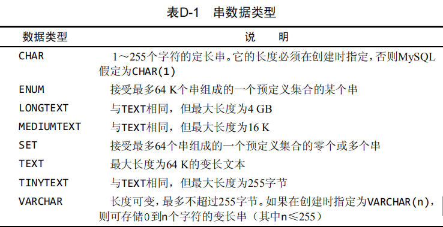

##### 2. 数值类型

```
数值数据类型存储数值。MySQL支持多种数值数据类型，每种存储的数值具有不同的取值范围。支持的取值范围越大，所需存储空间越多
与字符串不一样，数值不应该括在引号内
```

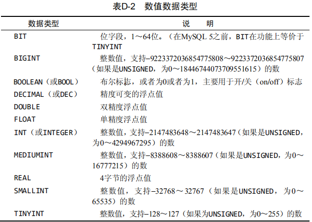

```mysql
decimal(5, 2) # 表示数值总共5位, 小数占2位
tinyint 1字节(8位) 0-255 ；-128，127
int 4字节。 -21亿，21亿 ；0 - 42亿
float.
# MySQL中没有专门存储货币的数据类型，一般情况下使用DECIMAL(8, 2)
```

###### 有符号或无符号

所有数值数据类型(除BIT和BOOLEAN外)都可以有符号或无符号

- 有符号数值列可以存储正或负的数值
- 无符号数值列只能存储正数
- 默认情况为有符号，但如果你知道自己不需要存储负值，可以使用UNSIGNED关键字

**注意：**

```
如果将邮政编码类似于01234存储为数值类型，则保存的将是数值1234，此时需要使用字符串类型
手机号应该用什么进行存储呢？也应该用字符串类型
```

##### 3. 日期和时间类型

```
MySQL使用专门的数据类型来存储日期和时间值
```

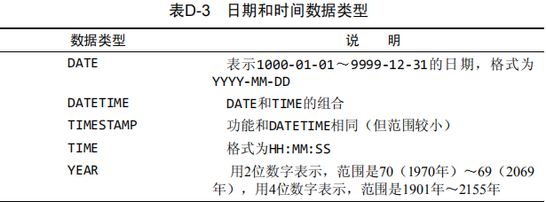

```mysql
datetime 8字节 1000-01-01 00:00:00 ~ 9999-12-31 23:59:59
```

##### 4. 二进制数据类型

```
二进制数据类型可存储任何数据（甚至包括二进制信息），如图像、多媒体、字处理文档等
```

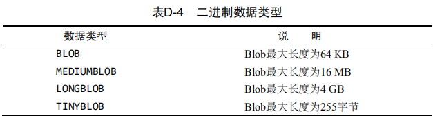

#### 二、表的字段约束

- unsigned 无符号(给数值类型使用，表示为正数，不写可以表示正负数都可以)
- 字段类型后面加括号限制宽度
  - char(5). varchar(7) 在字符类型后面加限制 表示 字符串的长度
  - int(4) 没有意义，默认无符号的int为int(11)，有符号的int(10)
  - int(4) unsigned zerofill只有当给int类型设置有前导零时，设置int的宽度才有意义。
- not null 不能为空,在操作数据库时如果输入该字段的数据为NULL ，就会报错
- default 设置默认值
- primary key 主键不能为空,且唯一.一般和自动递增一起配合使用。
- auto_increment 定义列为自增属性，一般用于主键，数值会自动加1
- unique 唯一索引(数据不能重复:用户名)可以增加查询速度,但是会降低插入和更新速度

#### 三、MySQL的运算符

- 算术运算符： +、 -、 *、 /、 %

- 比较运算符： =、 >、 <、 >=、 <=、!=

- 数据库特有的比较： in、not in、is null、is not null、like、between、and

- 逻辑运算符： and、or、not

- like: 支持特殊符号%和_ ;

  `其中%表示任意数量的任意字符，_表示任意一位字符`

#### 四、主键

```
1、表中每一行都应该有可以唯一标识自己的一列，用于记录两条记录不能重复，任意两行都不具有相同的主键值
2、应该总是定义主键 虽然并不总是都需要主键，但大多数数据库设计人员都应保证他们创建的每个表具有一个主键，以便于以后的数据操纵和管理。
```

##### 要求

- 记录一旦插入到表中，主键最好不要再修改。

- 不允许NULL。

- 不在主键列中使用可能会更改的值。

  `（例如，如果使用一个名字作为主键以标识某个供应商，当该供应商合并和更改其名字时，必须更改这个主键。）`

- 自增整数类型：数据库会在插入数据时自动为每一条记录分配一个自增整数，这样我们就完全不用担心主键重复，也不用自己预先生成主键。

- 可以使用多个列作为联合主键，但联合主键并不常用。使用多列作为主键时，所有列值的组合必须是唯一的。

### MySQL数据库与数据表操作

- 数据库的操作
  - 数据库创建
  - 数据库删除
- 数据表的操作
  - 数据表的创建
  - 数据表的修改 （表结构）
  - 数据表的删除

#### 数据库操作

##### 1. 数据库的创建

```mysql
# 链接mysql数据库后，进入demo后可以操作数据
# 1. 创建库
create database if not exists demo default charset=utf8；
-- 1. 数据库 demo 如果不存在则创建数据库，存在则不创建
-- 2. 创建 demo 数据库，并设置字符集为utf8
-- 3. 无特殊情况都要求字符集为utf8或者utf8mb4的字符编码
```

##### 2. 查看所有库

```mysql
# 1. 查看所有库
show databases;
```

##### 3. 打开库/进入库/选择库

```mysql
# use 库名
use demo
```

##### 4. 删除库

```mysql
# 删除库，那么库中的所有数据都将在磁盘中删除。
drop database 库名

# 注意：删库有风险，动手需谨慎
```

#### 数据表操作

##### 1. 创建表

```mysql
# 语法格式：
create table 表名(字段名，类型，【字段约束】，。。。)；

# 实例：
# 以下创建一个 users 的表
create table users(
-- 创建ID字段，为正整数，不允许为空 主键，自动递增
id int unsigned not null primary key auto_increment,
-- 创建 存储 名字的字段，为字符串类型，最大长度 5个字符，不允许为空
username varchar(5) not null,
-- 创建存储 密码 的字段，固定长度 32位字符， 不允许为空
password char(32) not null,
-- 创建 年龄 字段，不允许为空，默认值为 20
age tinyint not null default 20
)engine=innodb default charset=utf8;
# 查看表结构
desc users；
#查看建表语句
show create table users;
```

创建表的基本原则：

- 表明和字段名 尽可能的符合命名规范，并且最好能够‘见名之意’
- 表中数据必须有唯一标示，即主键定义。无特殊情况，主键都为数字并自增即可
- 表中字段所对应的类型设置合理，并限制合理长度
- 表引擎推荐使用innodb，并无特殊情况都要求为utf8或者utf8mb4的字符编码

##### 2. 修改表结构

`语法格式：alter table 表名 action (更改的选项)`

###### 添加字段

```mysql
# 语法：alter table 表名 add 添加的字段信息
-- 在 users 表中 追加 一个 num 字段
alter table users add num int not null;
-- 在指定字段后面追加字段 在 users 表中 age字段后面 添加一个 email 字段
alter table users add email varchar(50) after age;
-- 在指定字段后面追加字段，在 users 表中 age字段后面 添加一个 phone
alter table users add phone char(11) not null after age;
-- 在表的最前面添加一个字段
alter table users add aa int first;
```

###### 删除字段

```mysql
# 删除字段 alter table 表名 drop 被删除的字段名
alter table users drop aa;
```

###### 修改字段

```mysql
# 语法格式： alter table 表名 change|modify 被修改的字段信息
change: 可以修改字段名，
modify: 不能修改字段名。
# 修改表中的 num 字段 类型，使用 modify 不修改表名
alter table users modify num tinyint not null default 12;
# 修改表中的 num 字段 为 int并且字段名为 nn
alter table users change num mm int;
# 注意：一般情况下，无特殊要求，不要轻易修改表结构
```

##### 3. 修改表名

```mysql
# 语法：alter table 原表名 rename as 新表名
```

##### 4. 更改表的自增的值

```mysql
# 在常规情况下，auto_increment 默认从1开始继续递增
alter table users auto_increment = 1000;
```

##### 5. 修改表引擎

```mysql
# 推荐在定义表时，表引擎为 innodb。
# 通过查看建表语句获取当前的表引擎
mysql> show create table users\G;
*************************** 1. row ***************************
Table: users
Create Table: CREATE TABLE `users` (
PRIMARY KEY (`id`)
) ENGINE=InnoDB AUTO_INCREMENT=1001 DEFAULT CHARSET=utf8
1 row in set (0.00 sec)
# 直接查看当前表状态信息
mysql> show table status from tlxy where name = 'users'\G;
*************************** 1. row ***************************
Name: users
Engine: InnoDB
# 修改表引擎语句
alter table users engine = 'myisam';
```

##### 6. 删除表

```mysql
drop table 表名
```

### MySQL数据库表引擎与字符集

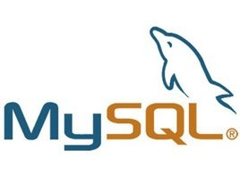

#### 1. 服务器处理客户请求

其实不论客户端进程和服务器进程是采用哪种方式进行通信，最后实现的效果都是：**客户端进程向服务器进程发送一段文本（MySQL语句），服务器进程处理后再向客户端进程发送一段文本（处理结果）**。那服务器进程对客户端进程发送的请求做了什么处理，才能产生最后的处理结果呢？客户端可以向服务器发送增删改查各类请求，我们
这里以比较复杂的查询请求为例来画个图展示一下大致的过程：

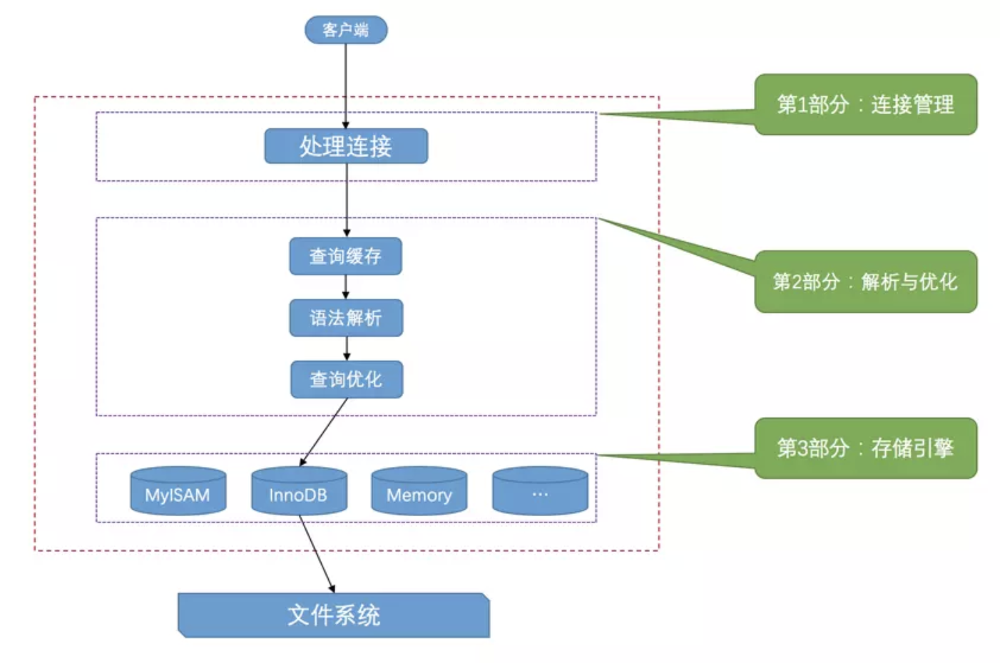

```
虽然查询缓存有时可以提升系统性能，但也不得不因维护这块缓存而造成一些开销，比如每次都要去查询缓存中检索，查询请求处理完需要更新查询缓存，维护该查询缓存对应的内存区域。从MySQL 5.7.20开始，不推荐使用查询缓存，并在MySQL 8.0中删除。
```

#### 2. 存储引擎

`MySQL`服务器把数据的存储和提取操作都封装到了一个叫`存储引擎`的模块里。我们知道`表`是由一行一行的记录组成的，但这只是一个逻辑上的概念，物理上如何表示记录，怎么从表中读取数据，怎么把数据写入具体的物理存
储器上，这都是`存储引擎`负责的事情。为了实现不同的功能，`MySQL`提供了各式各样的`存储引擎`，不同`存储引擎`管理的表具体的存储结构可能不同，采用的存取算法也可能不同。

```
存储引擎以前叫做 表处理器 ，它的功能就是接收上层传下来的指令，然后对表中的数据进行提取或写入操
作。
```

为了管理方便，人们把 连接管理 、查询缓存 、语法解析 、查询优化这些并不涉及真实数据存储的功能划分为
`MySQL server`的功能，把真实存取数据的功能划分为`存储引擎`的功能。各种不同的存储引擎向上边的

`MySQL server`层提供统一的调用接口（也就是存储引擎API），包含了几十个底层函数，像"读取索引第一条内容"、"读取索引下一条内容"、"插入记录"等等。
所以在 `MySQL server`完成了查询优化后，只需按照生成的执行计划调用底层存储引擎提供的API，获取到数据后返回给客户端就好了。

`MySQL`支持非常多种`存储引擎`：

|  存储引擎   |                 描述                 |
| :---------: | :----------------------------------: |
|  `ARCHIVE`  | 用于数据存档（行被插入后不能再修改） |
| `BLACKHOLE` |    丢弃写操作，读操作会返回空内容    |
|    `CSV`    |  在存储数据时，以逗号分隔各个数据项  |
| `FEDERATED` |            用来访问远程表            |
|  `InnoDB`   |    具备外键支持功能的事务存储引擎    |
|  `MEMORY`   |             置于内存的表             |
|   `MEGRE`   |   用来管理多个MyISAM表构成的表集合   |
|  `MyISAM`   |       主要的非事务处理存储引擎       |
|    `NDB`    |        MySQL集群专用存储引擎         |

#### 3. MyISAM与InnoDB的区别

##### 1) 事物支持

```
MyISAM不支持事务，而InnoDB支持。
事物：访问并更新数据库中数据的执行单元。事物操作中，要么都执行要么都不执行
```

##### 2) 存储结构

MyISAM：每个MyISAM在磁盘上存储成三个文件。

- `.frm`文件存储表结构。
- `.MYD`文件存储数据。
- `.MYI`文件存储索引。

InnoDB：主要分为两种文件进行存储

- `.frm` 存储表结构
- `.ibd` 存储数据和索引 （也可能是多个`.ibd`文件，或者是独立的表空间文件）

##### 3) 表锁差异

```
MyISAM：只支持表级锁，用户在操作myisam表时，select，update，delete，insert语句都会给表自动加锁，如
果加锁以后的表满足insert并发的情况下，可以在表的尾部插入新的数据。 
InnoDB：支持事务和行级锁，是innodb的最大特色。行锁大幅度提高了多用户并发操作的新能。但是InnoDB的行锁，只是在WHERE的主键是有效的，非主键的WHERE都会锁全表的。
```

##### 4) 表主键

```
MyISAM：允许没有任何索引和主键的表存在，索引都是保存行的地址。 
InnoDB：如果没有设定主键或者非空唯一索引，就会自动生成一个6字节的主键(用户不可见)，数据是主索引的一部分，附加索引保存的是主索引的值。InnoDB的主键范围更大，最大是MyISAM的2倍。
```

##### 5) 表的具体行数

```
MyISAM：保存有表的总行数，如果select count() from table;会直接取出出该值。 
InnoDB：没有保存表的总行数(只能遍历)，如果使用select count() from table；就会遍历整个表，消耗相当大，但是在加了wehre条件后，myisam和innodb处理的方式都一样。
```

##### 6) CURD操作

```
MyISAM：如果执行大量的SELECT，MyISAM是更好的选择。 
InnoDB：如果你的数据执行大量的INSERT或UPDATE，出于性能方面的考虑，应该使用InnoDB表。DELETE 从性能上InnoDB更优，但DELETE FROM table时，InnoDB不会重新建立表，而是一行一行的删除，在innodb上如果要清空保存有大量数据的表，最好使用truncate table这个命令。
```

##### 7) 外键

- MyISAM：不支持 
- InnoDB：支持

##### 8) 查询效率

```
MyISAM相对简单，所以在效率上要优于InnoDB，小型应用可以考虑使用MyISAM。推荐考虑使用InnoDB来替代MyISAM引擎，原因是InnoDB自身很多良好的特点，比如事务支持、存储 过程、视图、行级锁定等等，在并发很多的情况下，相信InnoDB的表现肯定要比MyISAM强很多。另外，任何一种表都不是万能的，只用恰当的针对业务类型来选择合适的表类型，才能最大的发挥MySQL的性能优势。如果不是很复杂的Web应用，非关键应用，还是可以继续考虑MyISAM的，这个具体情况可以自己斟酌。
```

##### 9) 应用场景

```
MyISAM管理非事务表。它提供高速存储和检索，以及全文搜索能力。如果应用中需要执行大量的SELECT查询，那么MyISAM是更好的选择。 InnoDB用于事务处理应用程序，具有众多特性，包括ACID事务支持。如果应用中需要执行大量的INSERT或UPDATE操作，则应该使用InnoDB，这样可以提高多用户并发操作的性能。现在默认使用InnoDB。
```

#### 4. 字符集

##### 字符集简介

```
我们知道在计算机中只能存储二进制数据，那该怎么存储字符串呢？当然是建立字符与二进制数据的映射关系了，
建立这个关系最起码要搞清楚两件事儿：
    1. 你要把哪些字符映射成二进制数据？
    	也就是界定清楚字符范围。
    2. 怎么映射？
    	将一个字符映射成一个二进制数据的过程也叫做 编码 ，将一个二进制数据映射到一个字符的过程叫做 解
    码 。
人们抽象出一个 字符集 的概念来描述某个字符范围的编码规则
```

##### 常用字符集

- `ASCII`字符集

  共收录128个字符，包括空格、标点符号、数字、大小写字母和一些不可见字符。由于总共才128个字符，所
  以可以使用1个字节来进行编码。

- `ISO 8859-1`字符集

  共收录256个字符，是在 ASCII 字符集的基础上又扩充了128个西欧常用字符(包括德法两国的字母)，也可以
  使用1个字节来进行编码。这个字符集也有一个别名`latin1`。

- `GB2312`字符集

  收录了汉字以及拉丁字母、希腊字母、日文平假名及片假名字母、俄语西里尔字母。其中收录汉字6763个，
  其他文字符号682个。同时这种字符集又兼容 ASCII 字符集。

- `GBK`字符集

  `GBK`字符集只是在收录字符范围上对`GB2312`字符集作了扩充，编码方式上兼容`GB2312`。

- `utf-8`字符集

  收录地球上能想到的所有字符，而且还在不断扩充。这种字符集兼容`ASCII`字符集，采用变长编码方式，编
  码一个字符需要使用1～4个字节，比方说这样：

  ```
  'L' -> 01001100（十六进制：0x4C）
  '啊' -> 111001011001010110001010（十六进制：0xE5958A）

  小贴士： 其实准确的说，utf8只是Unicode字符集的一种编码方案，Unicode字符集可以采用utf8、
  utf16、utf32这几种编码方案，utf8使用1～4个字节编码一个字符，utf16使用2个或4个字节编码一个
  字符，utf32使用4个字节编码一个字符。更详细的Unicode和其编码方案的知识不是本书的重点，大家
  上网查查哈～ MySQL中并不区分字符集和编码方案的概念，所以后边唠叨的时候把utf8、utf16、utf32
  都当作一种字符集对待。
  ```

#### 5. MySQL中的utf8和utf8mb4

我们上边说`utf8`字符集表示一个字符需要使用1～4个字节，但是我们常用的一些字符使用1～3个字节就可以表示
了。而在`MySQL`中字符集表示一个字符所用最大字节长度在某些方面会影响系统的存储和性能，所以`MySQL`定义了两个概念：

- `utf8mb3`：阉割过的`utf8`字符集，只使用1～3个字节表示字符。
- `utf8mb4`：正宗的`utf8`字符集，使用1～4个字节表示字符。

有一点需要大家十分的注意，在`MySQL`中`utf8`是`utf8mb3`的别名，所以之后在`MySQL`中提到`utf8 `就意味着使用1~3个字节来表示一个字符，如果大家有使用4字节编码一个字符的情况，比如存储一些emoji表情啥的，那请使
用`utf8mb4`。

##### MySQL字符集查看

`MySQL`支持好多好多种字符集，查看当前 MySQL 中支持的字符集可以用下边这个语句：

```mysql
show charset;
+----------+---------------------------------+---------------------+--------+
| Charset  | Description                     | Default collation   | Maxlen |
+----------+---------------------------------+---------------------+--------+
| big5     | Big5 Traditional Chinese        | big5_chinese_ci     |      2 |
| dec8     | DEC West European               | dec8_swedish_ci     |      1 |
| cp850    | DOS West European               | cp850_general_ci    |      1 |
| hp8      | HP West European                | hp8_english_ci      |      1 |
| koi8r    | KOI8-R Relcom Russian           | koi8r_general_ci    |      1 |
| latin1   | cp1252 West European            | latin1_swedish_ci   |      1 |
| latin2   | ISO 8859-2 Central European     | latin2_general_ci   |      1 |
| swe7     | 7bit Swedish                    | swe7_swedish_ci     |      1 |
| ascii    | US ASCII                        | ascii_general_ci    |      1 |
| ujis     | EUC-JP Japanese                 | ujis_japanese_ci    |      3 |
| sjis     | Shift-JIS Japanese              | sjis_japanese_ci    |      2 |
| hebrew   | ISO 8859-8 Hebrew               | hebrew_general_ci   |      1 |
| tis620   | TIS620 Thai                     | tis620_thai_ci      |      1 |
| euckr    | EUC-KR Korean                   | euckr_korean_ci     |      2 |
| koi8u    | KOI8-U Ukrainian                | koi8u_general_ci    |      1 |
| gb2312   | GB2312 Simplified Chinese       | gb2312_chinese_ci   |      2 |
| greek    | ISO 8859-7 Greek                | greek_general_ci    |      1 |
| cp1250   | Windows Central European        | cp1250_general_ci   |      1 |
| gbk      | GBK Simplified Chinese          | gbk_chinese_ci      |      2 |
| latin5   | ISO 8859-9 Turkish              | latin5_turkish_ci   |      1 |
| armscii8 | ARMSCII-8 Armenian              | armscii8_general_ci |      1 |
| utf8     | UTF-8 Unicode                   | utf8_general_ci     |      3 |
| ucs2     | UCS-2 Unicode                   | ucs2_general_ci     |      2 |
| cp866    | DOS Russian                     | cp866_general_ci    |      1 |
| keybcs2  | DOS Kamenicky Czech-Slovak      | keybcs2_general_ci  |      1 |
| macce    | Mac Central European            | macce_general_ci    |      1 |
| macroman | Mac West European               | macroman_general_ci |      1 |
| cp852    | DOS Central European            | cp852_general_ci    |      1 |
| latin7   | ISO 8859-13 Baltic              | latin7_general_ci   |      1 |
| utf8mb4  | UTF-8 Unicode                   | utf8mb4_general_ci  |      4 |
| cp1251   | Windows Cyrillic                | cp1251_general_ci   |      1 |
| utf16    | UTF-16 Unicode                  | utf16_general_ci    |      4 |
| utf16le  | UTF-16LE Unicode                | utf16le_general_ci  |      4 |
| cp1256   | Windows Arabic                  | cp1256_general_ci   |      1 |
| cp1257   | Windows Baltic                  | cp1257_general_ci   |      1 |
| utf32    | UTF-32 Unicode                  | utf32_general_ci    |      4 |
| binary   | Binary pseudo charset           | binary              |      1 |
| geostd8  | GEOSTD8 Georgian                | geostd8_general_ci  |      1 |
| cp932    | SJIS for Windows Japanese       | cp932_japanese_ci   |      2 |
| eucjpms  | UJIS for Windows Japanese       | eucjpms_japanese_ci |      3 |
| gb18030  | China National Standard GB18030 | gb18030_chinese_ci  |      4 |
+----------+---------------------------------+---------------------+--------+
```

### DML-数据的增删改

数据的DML操作：添加数据，修改数据，删除数据

#### 添加数据

```mysql
# 格式： insert into 表名[(字段列表)] values(值列表...);
-- 标准添加（指定所有字段，给定所有的值）
mysql> insert into stu(id,name,age,sex,classid) values(1,'zhangsan',20,'m','lamp138');
mysql>
--指定部分字段添加值
mysql> insert into stu(name,classid) value('lisi','lamp138');
-- 不指定字段添加值
mysql> insert into stu value(null,'wangwu',21,'w','lamp138');
-- 批量添加值
mysql> insert into stu values
-> (null,'zhaoliu',25,'w','lamp94'),
-> (null,'uu01',26,'m','lamp94'),
-> (null,'uu02',28,'w','lamp92'),
-> (null,'qq02',24,'m','lamp92'),
-> (null,'uu03',32,'m','lamp138'),
-> (null,'qq03',23,'w','lamp94'),
-> (null,'aa',19,'m','lamp138');
```

#### 修改数据

```mysql
# 格式：update 表名 set 字段1=值1,字段2=值2,字段n=值n... where 条件
-- 将id为11的age改为35，sex改为m值
mysql> update stu set age=35,sex='m' where id=11;
-- 将id值为12和14的数据值sex改为m，classid改为lamp92
mysql> update stu set sex='m',classid='lamp92' where id=12 or id=14 --等价于下面
mysql> update stu set sex='m',classid='lamp92' where id in(12,14);
```

#### 删除数据

```mysql
# 格式：delete from 表名 [where 条件]
-- 删除stu表中id值为100的数据
mysql> delete from stu where id=100;
-- 删除stu表中id值为20到30的数据
mysql> delete from stu where id>=20 and id<=30;
-- 删除stu表中id值为20到30的数据（等级于上面写法）
mysql> delete from stu where id between 20 and 30;
-- 删除stu表中id值大于200的数据
mysql> delete from stu where id>200;
```

### DQL-MySQL数据库查询SQL

```mysql
# 格式：
select 字段列表|* from 表名
[where 搜索条件]
[group by 分组字段 [having 分组条件]]
[order by 排序字段 排序规则]
[limit 分页参数]
```

#### 基础查询

```mysql
# 查询表中所有列 所有数据
select * from users;
# 指定字段列表进行查询
select id,name,phone from users;
```

#### Where条件查询

- 可以在where子句中指定任何条件
- 可以使用 and 或者 or 指定一个或多个条件
- where条件也可以运用在update和delete语句的后面
- where子句类似程序语言中if条件，根据mysql表中的字段值来进行数据的过滤

示例：

```mysql
-- 查询users表中 age > 22的数据
select * from users where age > 22;
-- 查询 users 表中 name=某个条件值 的数据
select * from users where name = '王五';
-- 查询 users 表中 年龄在22到25之间的数据
select * from users where age >= 22 and age <= 25;
select * from users where age between 22 and 25;
-- 查询 users 表中 年龄不在22到25之间的数据
select * from users where age < 22 or age > 25;
select * from users where age not between 22 and 25;
-- 查询 users 表中 年龄在22到25之间的女生信息
select * from users where age >= 22 and age <= 25 and sex = '女';
```

##### and 和 or 的使用

假设要求 查询 users 表中 年龄为22或者25 的女生信息
`select * from users where age=22 or age = 25 and sex = '女';`
思考上面的语句能否返回符合条件的数据？
实际查询结果并不符合要求？

```mysql
select * from users where age=22 or age = 25 and sex = '女';
+------+--------+------+-------+-------+------+------+
| id   | name   | age  | phone | email | sex  | mm    |
+------+--------+------+-------+-------+------+------+
| 1    | 章三   | 22    |       | NULL | 男    | 0   |
| 1002 | cc     | 25    | 123   | NULL | 女   | NULL |
+------+--------+------+-------+-------+------+------+
-- 上面的查询结果并不符合 查询条件的要求。
-- 问题出在 sql 计算的顺序上，sql会优先处理and条件，所以上面的sql语句就变成了
-- 查询变成了为年龄22的不管性别，或者年龄为 25的女生
-- 如何改造sql符合我们的查询条件呢？
-- 使用小括号来关联相同的条件
select * from users where (age=22 or age = 25) and sex = '女';
+------+------+------+-------+-------+------+------+
| id   | name | age  | phone | email | sex  | mm   |
+------+------+------+-------+-------+------+------+
| 1002 | cc   | 25   | 123   | NULL  | 女   | NULL |
+------+------+------+-------+-------+------+------+
```

##### Like子句

```mysql
我们可以在where条件中使用=,<,> 等符合进行条件的过滤，但是当想查询某个字段是否包含时如何过滤？
可以使用like语句进行某个字段的模糊搜索，
例如： 查询 name字段中包含五的数据

-- like 语句 like某个确定的值 和。where name = '王五' 是一样
select * from users where name like '王五';
+----+--------+------+-------+-----------+------+------+
| id | name   | age  | phone | email     | sex  | mm   |
+----+--------+------+-------+-----------+------+------+
| 5  | 王五    | 24   | 10011 | ww@qq.com | 男   | 0    |
+----+--------+------+-------+-----------+------+------+
1 row in set (0.00 sec)
-- 使用 % 模糊搜索。%代表任意个任意字符
-- 查询name字段中包含五的
select * from users where name like '%五%';
-- 查询name字段中最后一个字符 为 五的
select * from users where name like '%五';
-- 查询name字段中第一个字符 为 王 的
select * from users where name like '王%';
-- 使用 _ 单个的下划线。表示一个任意字符，使用和%类似
-- 查询表中 name 字段为两个字符的数据
select * from users where name like '__';
-- 查询 name 字段最后为五，的两个字符的数据
select * from users where name like '_五';
```

**注意：where子句中的like在使用%或者_进行模糊搜索时，效率不高，使用时注意：**

- 尽可能的不去使用%或者_
- 如果需要使用，也尽可能不要把通配符放在开头处

#### Mysql中的统计函数（聚合函数）

`max(),min(),count(),sum(),avg`

```mysql
# 计算 users 表中 最大年龄，最小年龄，年龄和及平均年龄
select max(age),min(age),sum(age),avg(age) from users;
+----------+----------+----------+----------+
| max(age) | min(age) | sum(age) | avg(age) |
+----------+----------+----------+----------+
| 28       | 20       | 202      | 22.4444  |
+----------+----------+----------+----------+
-- 上面数据中的列都是在查询时使用的函数名，不方便阅读和后期的调用，可以通过别名方式 美化
select max(age) as max_age,
min(age) min_age,sum(age) as sum_age,
avg(age) as avg_age
from users;
+---------+---------+---------+---------+
| max_age | min_age | sum_age | avg_age |
+---------+---------+---------+---------+
| 28      | 20      | 202     | 22.4444 |
+---------+---------+---------+---------+
-- 统计 users 表中的数据量
select count(*) from users;
+----------+
| count(*) |
+----------+
|     9    |
+----------+
select count(id) from users;
+-----------+
| count(id) |
+-----------+
|         9 |
+-----------+
-- 上面的两个统计，分别使用了 count(*) 和 count(id),结果目前都一样，有什么区别？
-- count(*) 是按照 users表中所有的列进行数据的统计，只要其中一列上有数据，就可以计算
-- count(id) 是按照指定的 id 字段进行统计，也可以使用别的字段进行统计，
-- 但是注意，如果指定的列上出现了NULL值，那么为NULL的这个数据不会被统计
-- 假设有下面这样的一张表需要统计
+------+-----------+------+--------+-----------+------+------+
|   id |   name    |  age |  phone |    email  | sex  | mm   |
+------+-----------+------+--------+-----------+------+------+
|    1 |   章三    | 22   |        |   NULL    |  男   |   0  |
|    2 |   李四    | 20   |        |   NULL    |  女   |   0 |
|    5 |   王五    | 24   |  10011 | ww@qq.com |  男   |   0 |
| 1000 |     aa    | 20   |    123 |   NULL   |  女    | NULL |
| 1001 |     bb    | 20   | 123456 |   NULL   |  女    | NULL |
| 1002 |     cc    | 25   |    123 |   NULL   |  女    | NULL |
| 1003 |     dd    | 20   |    456 |   NULL   |  女    | NULL |
| 1004 |     ff    | 28   |    789 |   NULL   |  男    | NULL |
| 1005 |  王五六    | 23   |    890 |   NULL   | NULL  | NULL |
+------+-----------+------+--------+-----------+------+------+
9 rows in set (0.00 sec)
-- 如果按照sex这一列进行统计，结果就是8个而不是9个，因为sex这一列中有NULL值存在
mysql> select count(sex) from users;
+------------+
| count(sex) |
+------------+
| 8          |
+------------+

# 聚合函数除了以上简单的使用意外，通常情况下都是配合着分组进行数据的统计和计算
```

#### Group BY 分组

```
group by 语句根据一个或多个列对结果集进行分组
一般情况下，是用与数据的统计或计算，配合聚合函数使用
```

```mysql
-- 统计 users 表中 男女生人数,
-- 很明显按照上面的需要，可以写出两个语句进行分别统计
select count(*) from users where sex = '女';
select count(*) from users where sex = '男';
-- 可以使用分组进行统计，更方便
select sex,count(*) from users group by sex;
+------+----------+
| sex  | count(*) |
+------+----------+
|  男  |   4      |
|  女  |   5      |
+------+----------+
-- 统计1班和2班的人数
select classid,count(*) from users group by classid;
+---------+----------+
| classid | count(*) |
+---------+----------+
| 1 | 5 |
| 2 | 4 |
+---------+----------+
-- 分别统计每个班级的男女生人数
select classid,sex,count(*) as num from users group by classid,sex;
+---------+------+-----+
| classid | sex | num |
+---------+------+-----+
| 1 | 男 | 2 |
| 1 | 女 | 3 |
| 2 | 男 | 2 |
| 2 | 女 | 2 |
+---------+------+-----+
# 注意，在使用。group by分组时，一般除了聚合函数，其它在select后面出现的字段列都需要出现在grouop by后面
```

###### Having子句

```mysql
having时在分组聚合计算后，对结果再一次进行过滤，类似于where，
where过滤的是行数据，having过滤的是分组数据
-------------------------------------------------------
-- 要统计班级人数
select classid,count(*) from users group by classid;
-- 统计班级人数，并且要人数达到5人及以上
select classid,count(*) as num from users group by classid having num >=5;
```

#### Order by 排序

```mysql
我们在mysql中使用select的语句查询的数据结果是根据数据在底层文件的结构来排序的，
首先不要依赖默认的排序，另外在需要排序时要使用orderby对返回的结果进行排序
Asc 升序，默认
desc降序
-----------------------------------------------------------
-- 按照年龄对结果进行排序，从大到小
select * from users order by age desc;
-- 从小到大排序 asc 默认就是。可以不写
select * from users order by age;
-- 也可以按照多个字段进行排序
select * from users order by age,id; # 先按照age进行排序，age相同情况下，按照id进行排序
select * from users order by age,id desc;
```

#### Limit 数据分页

- limit n 提取n条数据
- limit m,n 跳过m条数据，提取n条数据

```mysql
-- 查询users表中的数据，只要3条
select * from users limit 3;
-- 跳过前4条数据，再取3条数据
select * from users limit 4,3;
-- limit一般应用在数据分页上面
-- 例如每页显示10条数据，第三页的 limit应该怎么写？ 思考
第一页 limit 0,10
第二页 limit 10,10
第三页 limit 20,10
第四页 limit 30,10
-- 提取 user表中 年龄最大的三个用户数据 怎么查询？
select * from users order by age desc limit 3;
```

#### 总结:

```
mysql中的查询语句比较灵活多样，所以需要多加练习，
并且在使用查询语句时，一定要注意sql的正确性和顺序
```

| 子句     | 说明                             | 是否必须           |
| -------- | -------------------------------- | ------------------ |
| select   | 要返回的列或表达式，字段列表\| * | 是                 |
| from     | 查询的数据表                     | 需要在表中查询时   |
| where    | 数据行的过滤                     | 否                 |
| group by | 分组                             | 仅在分组聚合计算时 |
| having   | 分组后的数据过滤                 | 否                 |
| order by | 输出排序                         | 否                 |
| limit    | 要提取的结果行数                 | 否                 |

### 数据库备份及授权

#### 数据导出

##### 1. 数据库数据导出

```mysql
# 不要进入mysql，然后输入以下命令 导出某个库中的数据
mysqldump -u root -p 库名 > ~/Desktop/code/库名.sql

导出一个库中所有数据，会形成一个建表和添加语句组成的sql文件
之后可以用这个sql文件到别的库，或着本机中创建或回复这些数据
```

##### 2. 数据表数据导出

```mysql
# 不要进入mysql，然后输入以下命令 导出某个库中指定的表的数据
mysqldump -u root -p demo users > ~/Desktop/code/demo-users.sql
```

#### 数据导入

把导出的sql文件数据导入到mysql数据库中

```mysql
# 在新的数据库中 导入备份的数据，导入导出的sql文件
mysql -u root -p ops < ./demo.sql

# 把导出的表sql 导入数据库
mysql -u root -p ops < ./demo-users.sql
```

#### 权限管理

```mysql
mysql中的root用户是数据库中权限最高的用户，千万不要用在项目中。
可以给不同的用户，或者项目，创建不同的mysql用户，并适当的授权，完成数据库的相关操作
这样就一定程度上保证了数据库的安全。

创建用户的语法格式：
grant 授权的操作 on 授权的库.授权的表 to 账户@登录地址 identified by ‘密码’;
示例：

# 在mysql中 创建一个 zhangsan 用户，授权可以对tlxy这个库中的所有表 进行 添加和查询 的权限
grant select,insert on tlxy.* to zhangsan@'%' identified by '123456';
# 用户 lisi。密码 123456 可以对demo库中的所有表有 所有操作权限
grant all on demo.* to lisi@'%' identified by '123456';
# 删除用户
drop user 'lisi'@'%';
```