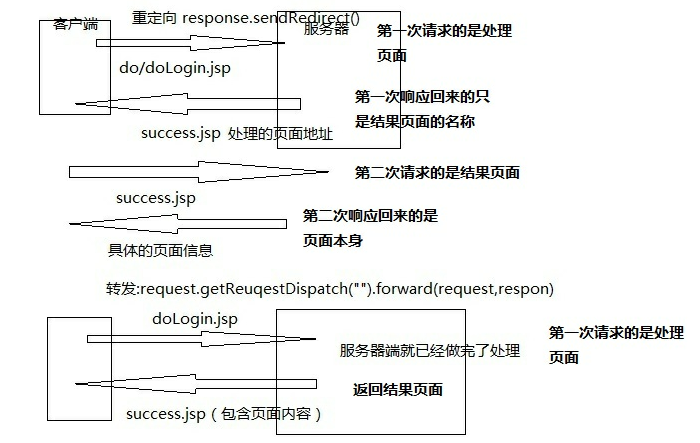

## Servlet

### Servlet概述

1. Servlet(Server Applet)，全称Java Servlet。是用Java编写的服务器端程序，其主要功能在于交互式地浏览和修改数据，生成动态Web内容。狭义的Servlet是指Java语言实现的一个接口，广义的Servlet是指任何实现了这个Servlet接口的类，一般情况下，人们将Servlet理解为后者。

2. Servlet运行于支持Java的应用服务器中。从实现上讲，servlet可以响应任何类型的请求，但绝大多数情况下Servlet只用来扩展基于HTTP协议的Web服务器。

3. Servlet工作模式：

   ```
   1. 客户端发送请求至服务器
   2. 服务器启动并调用Servlet，Servlet根据客户端请求生成响应内容并将其传给服务器
   3. 服务器将响应返回客户端
   ```

### Servlet API


### 第一个Servlet

1. 创建一个类实现Servlet接口，重写方法。(或者继承HttpServlet)

   ```java
   class LoginServlet implements Servlet {
       @Override
       public void init(ServletConfig servletConfig) throws ServletException {
           //这是初始化方法
       }
       
       @Override
       public ServleConfig getServletConfig() {
           return null;
       }
       
       @Override
       public void service(ServletRequest servletRequest, ServletResponse servletResponse) throws ServletException, IOException {
           //处理get/post请求的方法
       }
       
       @Override
       public String getServletInfo() {
           return null;
       }
       
       @Override
       public void destroy() {
           //销毁Servlet的方法
       }
       
   }
   ```

2. 在web.xml文档中配置映射关系

   ```xml
   XML中配置好这个Servlet的映射关系：

       <servlet>
           <servlet-name>自定义名称</servlet-name>
           <servlet-class>处理请求的类的完整路径</servlet-class>
       </servlet>
       <servlet-mapping><!-- mapping 表示映射 -->
           <servlet-name>自定义名称</servlet-name>
           <url-pattern>请求名</url-pattern>
       </servlet-mapping>

   标签的执行顺序：
   	请求过来以后->web.xml->servlet-mapping标签中的url-pattern标签中的内容和请求名进行匹配->匹配成功后找对应的servlet-mapping标签中的servlet-name->去servlet标签中找和上一个servlet-name相同的name值->去找servlet标签中的servlet-class中处理类的完整路径。
   ```

3. 启动tomcat，在浏览器中输入[http://localhost:8080/](http://localhost:8080/)工程名/访问服务器的路径

### Servelt工作原理

- Servelt接口口定义了**Servlet与Servlet容器**之间的约定。这个约定是：Servlet容器将Servlet类载入内存，并产生Servlet实例和调用它具体的方法。但是要注意的是，**在一个应用程序中，每种Servlet类型只能有一个实例**。
- 用户请求致使Servlet容器调用Servlet的Service()方法，**并传入一个ServletRequest对象和一个ServletResponse对象。ServletRequest对象和ServletResponse对象都是由Servlet容器（例如TomCat）封装好的，并不需要程序员去实现，程序员可以直接使用这两个对象**。
- ServletRequest中封装了当前的Http请求，因此，开发人员不必解析和操作原始的Http数据。ServletResponse表示当前用户的Http响应，程序员只需直接操作ServletResponse对象就能把响应轻松的发回给用户。
- 对于每一个应用程序，**Servlet容器还会创建一个ServletContext对象。这个对象中封装了上下文（应用程序）的环境详情。每个应用程序只有一个ServletContext。每个Servlet对象也都有一个封装Servlet配置的ServletConfig对象**。

### Servlet的生命周期

```
1. 当客户端首次发送第一次请求后，由容器(web服务器(tomcat))去解析请求, 根据请求找到对应的servlet,判断该类的对象是否存在，不存在则创建servlet实例，调取init()方法 进行初始化操作,初始化完成后调取service()方法,由service()判断客户端的请求方式，如果是get，则执行doGet(),如果是post则执行doPost().处理方法完成后,作出相应结果给客户端.单次请求处理完毕。

2. 当用户发送第二次以后的请求时,会判断对象是否存在,但是不再执行init()，而直接执行service方法,调取doGet()/doPost()方法。

3. 当服务器关闭时调取destroy()方法进行销毁。
```

简单来说就是四个过程：

1. 实例化-->先创建servlet实例
2. 初始化-->调用init()方法
3. 处理请求-->调用service()方法
4. 服务终止-->调用destroy()方法销毁


### 请求

```java
HttpServletRequest表示Http环境中的Servlet请求。(它扩展与javax.servlet.ServletRequest接口)

常用的方法有:
	1. String getParameter(String name);
        // 根据表单组件名称获取提交数据，返回值是Sting类型
    2. String[] getParameterValues(String name);
        // 获取表单组件对应多个值时的请求数据
   	3. void setCharacterEncoding(String charset);
	    // 指定每个请求的编码(只对post请求起作用)
    4. RequestDispatcher getRequestDispatcher(String path);
		// 用于跳转页面，返回一个RequestDispatcher对象，该对象的forward()方法用于转发请求。(request.getRequestDispacher("../index.jsp").forward(request, resposnse);)
    5. request.setAttribute(key, value);
		// 存值 
    6. request.setAttribute(key);
		// 取值，取值后需要向下转型
	示例：
		String a = (String) request.getAttribute(key);
```

#### 客户端向服务器发送请求的方式

##### 1. 通过form表单的 get/post 提交

```html
<form action="" method="get/post">
    <input type="text" name="uname"><br>
    <input type="submit" value="提交">
</form>
```

##### 2. 通过a标签发送数据(get请求)

```
<a href="请求名?key=value&key=value&key=value...">
示例:
   	<a href="/login?a=10&name=tom&pass=123">

这里的key=表单元素的控件名，value=表单中控件的value属性值
注意：
    第一个参数使用?拼接，之后的参数使用&拼接，获取的数据可以通过String name = request.getParameter("name");
```

##### 3. 通过地址栏直接拼接(get请求)

示例：

​	[http://localhost:8080/login?name=tom&pass=123](http://localhost:8080/login?name=tom&pass=123)

##### 4. js提交数据(get请求)

```javascript
location.href("目标请求?key=vlaue&key=value...")
```

注意:

​	方式2、3、4都属于get提交方式，表单提交可以使用(get/post)提交方式。

#### 处理请求乱码的方式

##### 1. setCharaterEncoding("utf-8");

​	用于post请求乱码

##### 2. String s = new String(变量名.getBytes("ISO-8859-1"), "utf-8");

​	用于get请求中文乱码

##### 3. 修改tomcat中配置文件

​	用于get请求乱码。在Tomcat目录结构\conf\server.xml中设置字符集

```xml
<Connector port="8080" protocol="HTTP/1.1"
    connectionTimeout="20000"
    redirectPort="8443" URIEncoding="UTF-8" />
```

注意: tomcat8.0以后默认为utf-8。

#### get与post的区别

```
1. 数据放置位置
GET请求，请求的数据会附加在URL之后，以?分割URL和传输数据，多个参数用&连接。URL的编码格式采用的是ASCII编码，而不是uniclde，即是说所有的非ASCII字符都要编码之后再传输。
POST请求：POST请求会把请求的数据放置在HTTP请求包的包体中。
因此，GET请求的数据会暴露在地址栏中，而POST请求则不会。
2.传输数据的大小
在HTTP规范中，没有对URL的长度和传输的数据大小进行限制。但是在实际开发过程中，对于GET，特定的浏览器和服务器对URL的长度有限制。因此，在使用GET请求时，传输数据会受到URL长度的限制。
对于POST，由于不是URL传值，理论上是不会受限制的，但是实际上各个服务器会规定对POST提交数据大小进行限制，Apache、IIS都有各自的配置。
3. 安全性
POST的安全性比GET的高。这里的安全是指真正的安全，而不同于上面GET提到的安全方法中的安全，上面提到的安全仅仅是不修改服务器的数据。比如，在进行登录操作，通过GET请求，用户名和密码都会暴露再URL上，因为登录页面有可能被浏览器缓存以及其他人查看浏览器的历史记录的原因，此时的用户名和密码就很容易被他人拿到
了。除此之外，GET请求提交的数据还可能会造成Cross-site request frogery攻击。
```

### 响应

```java
在Service API中，定义了一个HttpServletResponse接口，它继承自ServletResponse接口，专门用来封装HTTP响应消息。在HttpServletResponse接口中定义了向客户端发送响应状态码，响应消息头，响应消息体的方法。

常用方法有：
	1. void addCookie(Cookie var1);
		//给这个响应添加一个cookie
	2. void sendRedirect(String var1);
		// 发送一条响应码，将浏览器跳转到指定位置
	3. PrintWriter getWriter();
		// 获得字符流，通过字符流的writer(String s)方法可以将字符串设置到reponse缓冲区中，随后Tomcat会将response缓冲区中的内容组装成Http响应返回给浏览器端。
	4. setContentType()
		// 设置响应内容的类型
```

#### 转发与重定向对比



```
重定向: response.sendRedirect();
转发: request.getRequestDispatcher("../index.jsp").forward(request, response);

相同点:
	都是用来跳转页面
不同点:
	1. 重定向时地址栏会改变,request中存储的数据会丢失.转发时地址栏显示的是请求页面的地址,request数据可以保存。
	2. 转发属于一次请求一次响应,重定向属于两次请求(地址栏修改了两次)两次响应。
```

### 会话

```xml
request存的值只能在单次请求中保存，保存的数据不能跨页面,当重定向时,request存的值会丢失。session的数据可以在多个页面中共享,即使重定向页面,数据不会丢失。session中可以包含n个request。
会话的概念:从打开浏览器到关闭浏览器,期间访问服务器就称为一次会话。

常用方法有：
	1. void setAttribute(String key, Object value);
		// 以键值对的形式保存对象值，将数据存储在服务器端
	2. Object getAttribute(String key);
		// 通过key获取对象值
	3. void invalidate()
		// 设置session对象失效
	4. String getId()
		// 获取sessionId,当第一次登录成功后，session会产生一个唯一的id,浏览器之后访问时，如果发现id值还是之前的id，那么说明当前访问的属于同一个会话。
	5. void setMaxInactiveInterval(int interval)
		// 设定session的非活动时间
		示例:
			方式1: session.setMaxInactiveInterval(10 * 60);
				设置有效时间为10分钟
			方式2: 修改web.xml
				<session-config>
					<session-timeout>10</session-timeout><!--单位:分钟-->
				</session-config>
	6. int getMaxInactiveInterval();
		// 获取session的有效非活动时间(以秒为单位)，默认有效时间:30分钟
	7. void removeAttribute(String key);
		// 从session中删除指定key值所对应的对象
```

###获得初始化参数

```
request.setCharacterEncoding("utf-8");代码的耦合度太高，不便于后期维护修改。可以通过初始化参数实现。
```

- 实现方式:

  1. 局部初始化参数
     1. 首先在web.xml中定义初始化参数

        ```xml
        <servlet>
        	<servlet-name></servlet-name>
            <servlet-class></servlet-class>
            <init-param>
            	<param-name>encoding</param-name>
                <param-value>utf-8</param-value>
            </init-param>
        </servlet>
        ```

     2. servlet中获取初始化参数，重写init()方法

        ```java
        @Override
        public void init(ServletConfig config) throw ServletException {
            encoding = config.getInitParameter("encoding");
        }
        ```

        注意：这种方式的初始化参数仅限当前Servlet使用。

  2. 全局初始化参数

     1. 定义context-param标签, 它是和servlet标签同级别

        ```xml
        <context-param>
        	<param-name>encoidng</param-name>
            <param-value>utf-8</param-value>
        </context-param>
        ```

     2. 获得数据

        ```java
        @Override
        public void init(ServletConfig config) throws ServletException {
            encoding = config.getServletContext().getInitParameter("encoding");
        }
        ```

### Servlet3.0

```
注解方式实现Servlet，注解(提供给程序读取的信息)。
注解的格式:
	@WebServlet // 注解配置Servlet
从Servlet3.0开始，配置Servlet支持注解方式，但还是保留了配置web.xml方式，所有使用Servlet有两种方式，即:
	1. Servlet类上使用@WebServlet注解进行配置
	2. web.xml文件中配置
```

#### @WebServlet常用属性

| 属性              | 类型           | 是否必须 | 描述                                                         |
| ----------------- | -------------- | -------- | ------------------------------------------------------------ |
| asyncSupported    | boolean        | 否       | 指定Servlet是否支持异步操作模式                              |
| displayName       | String         | 否       | 指定Servlet显示名称                                          |
| initParams        | webInitParam[] | 否       | 配置初始化参数                                               |
| loadOnStartup     | int            | 否       | 标记容器是否在应用启动时就加载这个Servlet，等价于配置文件中的标签 |
| name              | String         | 否       | 指定Servlet名称                                              |
| urlPatterns/value | String[]       | 否       | 这两个属性作用相同，指定Servlet处理的url                     |

#### 示例：

1. web.xml方式

   ```xml
   <servlet>
   	<servlet-name>a</servlet-name>
       <servlet-class>
       	<!-- 处理类的完整路径 -->
           com.web.SelectServlet
       </servlet-class>
       <load-on-startup>1</load-on-startup>
   </servlet>
   ```

2. 注解方式

   ```java
   @WebServlet(name = "myUserServlet",
               urlPatterns = "/user/test", //斜杠必须
               loadOnStartup = 1,
               initParams = {
                   @WebInitParam(name="name", value="小明"),
                   @WebInitParam(name="pwd", value="123456")
               }
              )
   public class UserServlet extends HttpServlet {
       private static final long serialVersionUID = 7109220574468622594L;
       @Override
       public void init(ServletConfig config) throws ServletException {
           super.init(config);
           System.out.println("servlet初始化...");
       }
       @Override
       protected void doGet(HttpServletRequest request, HttpServletResponse response) throws
           ServletException, IOException {
           response.setContentType("text/html");
           response.setCharacterEncoding("utf-8");
           PrintWriter pw = response.getWriter();
           pw.append("Hello Servlet!<br>" );
           //servletName
           pw.append("servletName：" + getServletName() + "<br>");
           //initParam
           ServletConfig servletConfig = this.getServletConfig();
           Enumeration<String> paramNames = servletConfig.getInitParameterNames();
           while (paramNames.hasMoreElements()) {
               String paramName = paramNames.nextElement();
               pw.append(paramName + "：" + servletConfig.getInitParameter(paramName) + "<br>");
           }
           pw.close();
       }
       @Override
       protected void doPost(HttpServletRequest request, HttpServletResponse response) throws
           ServletException, IOException {
           doGet(request, response);
       }
   }
   ```

   ​