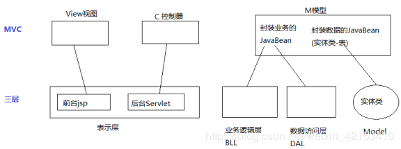

## JavaWEB MVC

## MVC设计模式

JavaWeb MVC中的M(模型)-V(视图)-C(控制器)概念和标准的MVC概念一样，一个WEB MVC标准架构，如下图所示:


在Web MVC模式下，模型无法主动推数据给视图，如果用户想要视图更新，需要再发送一次请求（即请求-响应模型）。

### M(Model)模型

```
应用程序的核心功能，管理这个模块中的数据和值(bean, dao)

JavaBeans :是Java中一种特殊的类（换言之：JavaBean就是一个Java类）.
一个Java类 ，满足以下要求，则可称为一个JavaBean
    a. public修饰的类，提供public 无参构造方法
    b. 所有属性 都是private
    c. 提供getter和setter方法
从使用层面来看，JavaBean分为2大类：
	a. 封装业务逻辑的JavaBean(eg:LoginDao.java 封装了登录逻辑)
	b. 封装数据的JavaBean(实体类：eg：Student.java Vadio.java 。往往对应于数据库中的一张表，即数据库
中有个Student表，项目中就有个Student.java类)通常:表名=类名，列名=属性名

JavaBean是一个可以重复使用的组件，通过编写一个组件来实现某种通用功能，“一次编写、任何地方执行、任何地方重用”。
```

### V(view)视图

```
视图提供模型的展示，管理模型如何显示给用户，它是应用程序的外观；（jsp/html）
```

### C（Controller）控制器

```
对用户的输入做出反应，管理用户和视图的交互，是连接模型和视图的枢纽。（servlet/service）
```

## 三层架构

```
三层架构 通常意义上的三层架构就是将整个业务应用划分为：
	表现层（UI）、业务逻辑层（BLL）、数据访问层（DAL）。区分层次的目的即为了“高内聚，低耦合”的思想。

1、表现层（UI）：通俗讲就是展现给用户的界面，即用户在使用一个系统的时候他的所见所得。 jsp/html
2、业务逻辑层（BLL）：针对具体问题的操作，也可以说是对数据层的操作，对数据业务逻辑处理。
servlet,service
3、数据访问层（DAL）：该层所做事务直接操作数据库，针对数据的增添、删除、修改、更新、查找等。dao

表现层实现的代表作品是Struts,springmvc框架，
业务层实现的代表作品是Spring，
持久层实现的代表作品是Hibernate,mybatis。

层就相当于一个黑盒子，我们不用知道它内部怎么实现，只需要知道如何去调用它就行了。每层只与上下相邻的两层打交道。当一层内部由于技术变迁发生变化时，只要接口不变，其他层不用做任何改变。分层之后灵活性提高，也便于团队分工开发。
```

### 三层架构和MVC的区别与联系



```
MVC是 Model-View-Controller，严格说这三个加起来以后才是三层架构中的UI层，也就是说，MVC把三层架构中的UI层再度进行了分化，分成了控制器、视图、实体三个部分，控制器完成页面逻辑，通过实体来与界面层完成通话；而C层直接与三层中的BLL进行对话。

MVC可以是三层中的一个表现层框架，属于表现层。三层和mvc可以共存。

三层是基于业务逻辑来分的，而MVC是基于页面来分的。

MVC主要用于表现层，3层主要用于体系架构，3层一般是表现层、中间层、数据层，其中表现层又可以分成M、V、C，(Model View Controller)模型－视图－控制器

MVC是表现模式（Presentation Pattern）

三层架构是典型的架构模式（Architecture Pattern）

三层架构的分层模式是典型的上下关系，上层依赖于下层。但MVC作为表现模式是不存在上下关系的，而是相互协作关系。即使将MVC当作架构模式，也不是分层模式。MVC和三层架构基本没有可比性，是应用于不同领域的技术。
```

