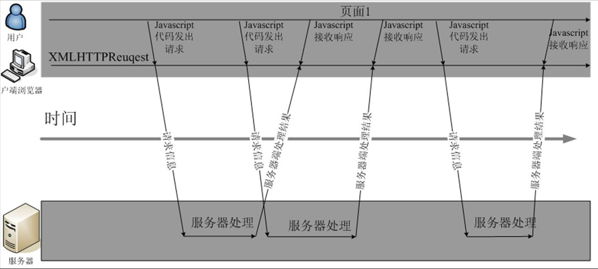

## AJAX

### AJAX技术与简介

#### AJAX简介

```
AJAX = Asynchronous JavaScript and XML（异步的JavaScript 和 XML）。
AJAX 不是新的编程语言，而是一种使用现有标准的新方法。
AJAX 是与服务器交换数据并更新部分网页的艺术，在不重新加载整个页面的情况下。
```

#### AJAX包含的技术

```
大家都知道ajax并非一种新的技术，而是几种原有技术的结合体。它由下列技术组合而成。

1. 使用CSS和XHTML来表示
2. 使用DOM模型来交互和动态显示
3. 使用XMLHttpRequest来和服务器进行异步通信
4. 使用javascript来绑定和调用

AJAX的核心是XMLHTTPRequest对象。
不同的浏览器创建XMLHttpRequset对象的方法是有差异的。
IE浏览器使用ActiveXObject，而其他的浏览器使用名为XMLHttpRequest的JavaScript内置对象。
```

#### AJAX的工作原理

```
Ajax的工作原理相当于在用户和服务器之间加了—个中间层(AJAX引擎)，使用户操作与服务器响应异步化。并不是所有的用户请求都提交给服务器。像—些数据验证和数据处理等都交给Ajax引擎自己来做,，只有确定需要从服务器读取新数据时再由Ajax引擎代为向服务器提交请求。
```

- AJAX工作原理


- 浏览器的AJAX交互方式



```
在创建Web站点时，在客户端执行屏幕更新为用户提供了很大的灵活性。下面是使用Ajax可以完成的功能： 动态更新购物车的物品总数，无需用户单击Update并等待服务器重新发送整个页面。 提升站点的性能，这是通过减少从服务器下载的数据量而实现的。例如，在Amazon的购物车页面，当更新篮子中的一项物品的数量时，会重新载入整个页面，这必须下载32K的数据。如果使用Ajax计算新的总量，服务器只会返回新的总量值，因此所需的带宽仅为原来的百分之一。 消除了每次用户输入时的页面刷新。例如，在Ajax中，如果用户在分页列表上单击Next，则服务器数据只刷新列表而不是整个页面。 直接编辑表格数据，而不是要求用户导航到新的页面来编辑数据。对于Ajax，当用户单击Edit时，可以将静态表格刷新为内容可编辑的表格。用户单击Done之后，就可以发出一个Ajax请求来更新服务器，并刷新表格，使其包含静态、只读的数据。
```


#### XMLHttpRequest常用属性

##### 1. onreadystatechange 属性

`onreadystatechange` 属性存储处理服务器响应的函数。 

下面的代码定义一个空的函数，可同时对`onreadystatechange` 属性进行设置：

```javascript
xmlHttp.onreadystatechange = function() {
	//执行代码
}
```

##### 2. readyState 属性

```
readyState 属性存有服务器响应的状态信息。每当 readyState 改变时，onreadystatechange 函数就会被执行。
```

- readyState 属性可能的值:

  | 状态 | 描述                                                         |
  | ---- | ------------------------------------------------------------ |
  | 0    | 请求未初始化（在调用 open() 之前）                           |
  | 1    | 请求已提出（调用send()之前）                                 |
  | 2    | 请求已发送（这里通常可以从响应得到的内容头部）               |
  | 3    | 请求处理中（响应中通常有部分数据可用，但是服务器还没有完成响应） |
  | 4    | 请求已完成（可以访问服务器响应并使用它）                     |

  ```javascript
  xmlHtttp.onreadystatechange = function() {
      if (xmlHttp.readyState == 4) {
          //从服务器的response获得数据
      }
  }
  ```

##### 3. responseText 属性

可以通过 `responseText `属性来取回由服务器返回的数据。 在我们的代码中，我们将把时间文本框的值设置为等于`responseText`：

```javascript
xmlHttp.onreadystatechange = function() {
    if (xmlHttp.readyState == 4) {
		document.myForm.time.value = xmlHttp.responseText;
    }
}
```

##### 4. 其它属性如下:


#### XMLHttpRequest 方法

##### 1. open() 方法

open()有三个参数：

- 第一个参数：定义发送请求所使用的方法
- 第二个参数：规定服务器端脚本的URL
- 第三个参数：规定应当对请求进行异步地处理

```javascript
xmlHttp.open("GET","test.jsp",true)
```

##### 2. send() 方法

send() 方法将请求送往服务器。如果我们假设`HTML`文件和`JSP`文件位于相同目录，那么代码可以这样写:

```javascript
xmlHttp.send(null);//仅用于POST请求
```

##### 3. 其他方法如下：


### AJAX编程步骤

> 1. 创建XMLHttpRequest对象
> 2. 设置请求方式
> 3. 调用回调函数
> 4. 发送请求

下面来看具体步骤：

#### 1. 创建XMLHttpRequest对象

```javascript
// 创建XMLHttpRequest对象语法格式
var xmlHttp = new XMLHttpRequest();

// 如果是IE5或IE6，则需要使用ActiveX对象
var xmlHttp = ActiveXObject("Microsoft.XMLHTTP");
```

一般我们手写AJAX的时候，首先要判断该浏览器是否支持`XMLHttpRequest`对象，如果支持则创建该对象，如果不支持则创建`ActiveX`对象。`JS`代码如下：

```javascript
//第一步：创建XMLHttpRequest对象
var xmlHttp;
if (window.XMLHttpRequest) {
	//非IE
	xmlHttp = new XMLHttpRequest();
} else if (window.ActiveXObject) {
    //IE
    xmlHttp = new ActiveXObject("Microsoft.XMLHTTP")
}
```

#### 2. 设置请求方式

```
在WEB开发中，请求有两种形式，一个是get，一个是post，所以在这里需要设置一下具体使用哪个请求，XMLHttpRequest对象的open()方法就是来设置请求方式的。
```

| 方法   | 功能                                    | 参数                                                         |
| ------ | --------------------------------------- | ------------------------------------------------------------ |
| open() | 规定请求的类型、URL以及是否异步处理请求 | 参数1：定义请求类型 ;参数2：脚本文件在服务器端的位置；参数3：是否异步处理请求(true/false) |

```javascript
var url = "http://localhost:8080/getAjax";
xmlHttp.open("POST", url, true);
```

##### 用GET还是POST?

```
与 POST 相比，GET 更简单也更快，并且在大部分情况下都能用。然而，在以下情况中，请使用 POST 请求：

    1. 无法使用缓存文件（更新服务器上的文件或数据库）
    2. 向服务器发送大量数据（POST 没有数据量限制）
    3.发送包含未知字符的用户输入时，POST 比 GET 更稳定也更可靠。
```

##### 异步(true/false)?

```
AJAX 指的是异步 JavaScript 和 XML（Asynchronous JavaScript and XML）。

XMLHttpRequest 对象如果要用于 AJAX 的话，其 open() 方法的 async 参数必须设置为 true：对于 web 开发人员来说，发送异步请求是一个巨大的进步。很多在服务器执行的任务都相当费时。AJAX 出现之前，这可能会引起应用程序挂起或停止。 通过 AJAX，JavaScript 无需等待服务器的响应，而是： 在等待服务器响应时执行其他脚本，当响应就绪后对响应进行处理。
```

#### 3. 调用回调函数

如果在上一步中open方法的第三个参数选择的是`true`，那么当前就是异步请求，这个时候需要写一个回调函数。

`XMLHttpRequest`对象有一个`onreadystatechange`属性，这个属性返回的是一个匿名的方法，所以回调函数就在`xmlHttp.onreadystatechange=function{}`这里写。`function{}`内部就是回调函数的内容。所谓回调函数，就是请求在后台处理完，再返回到前台所实现的功能。在这个例子里，我们的回调函数要实现的功能就是接收后台处理后反馈给前台的数据，然后将这个数据显示到指定的div上。因为从后台返回的数据可能是错误的，所以在回调函数中首先要判断后台返回的信息是否正确，如果正确才可以继续执行。代码如下：

```javascript
// 注册回调函数         
xmlHttp.onreadystatechange = function() {
    if (xmlHttp.readyState == 4) {
        if (xmlHttp.status == 200) {
            var obj = document.getElementById(id);
            obj.innerHTML = xmlHttp.responseText;
        } else {
            alert("AJAX服务器返回错误！");
        }
    }
}

// 在上面代码中，xmlHttp.readyState是存有XMLHttpRequest 的状态。
// 从 0 到 4 发生变化:
// 0: 请求未初始化。1:服务器连接已建立。2: 请求已接收。3: 请求处理中。4: 请求已完成，且响应已就绪。
// 所以这里我们判断只有当xmlHttp.readyState为4的时候才可以继续执行。xmlHttp.status是服务器返回的结果，其中200代表正确。404代表未找到页面，所以这里我们判断只有当xmlHttp.status等于200的时候才可以继续执行。


var obj = document.getElementById(id);obj.innerHTML = xmlHttp.responseText;
// 这段代码就是回调函数的核心内容，就是获取后台返回的数据，然后将这个数据赋值给id为testid的div。
// xmlHttp对象有两个属性都可以获取后台返回的数据，分别是：responseText和responseXML，其中responseText是用来获得字符串形式的响应数据，responseXML是用来获得 XML 形式的响应数据。
//至于选择哪一个是取决于后台给返回的数据的，这个例子里我们只是显示一条字符串数据所以选择的是responseText。
```

##### AJAX状态值与状态码区别

```
AJAX状态值是指，运行AJAX所经历过的几种状态，无论访问是否成功都将响应的步骤，可以理解成为AJAX运行步骤。如：正在发送，正在响应等，由AJAX对象与服务器交互时所得；使用“ajax.readyState”获得。（由数字1~4单位数字组成） 

AJAX状态码是指，无论AJAX访问是否成功，由HTTP协议根据所提交的信息，服务器所返回的HTTP头信息代码，该信息使用“ajax.status”所获得；（由数字1XX,2XX三位数字组成，详细查看RFC） 这就是我们在使用AJAX时为什么采用下面的方式判断所获得的信息是否正确的原因。

if(ajax.readyState == 4 && ajax.status == 200) {
    //获取后台响应数据
}
```

##### AJAX运行步骤与状态值说明 

```
在AJAX实际运行当中，对于访问XMLHttpRequest（XHR）时并不是一次完成的，而是分别经历了多种状态后取得的结果，对于这种状态在AJAX中共有5种，分别是： 
    0 - (未初始化)还没有调用send()方法
    1 - (载入)已调用send()方法，正在发送请求
    2 - (载入完成)send()方法执行完成
    3 - (交互)正在解析响应内容
    4 - (完成)响应内容解析完成，可以在客户端调用了
对于上面的状态，其中“0”状态是在定义后自动具有的状态值，而对于成功访问的状态（得到信息）我们大多数采用“4”进行判断。
```

##### AJAX状态码说明

- 1：请求收到，继续处理
- 2：操作成功收到，分析、接受
- 3：完成此请求必须进一步处理
- 4：请求包含一个错误语法或不能完成
- 5：服务器执行一个完全有效请求失败

具体如下：

```javascript
100——客户必须继续发出请求
101——客户要求服务器根据请求转换HTTP协议版本
200——交易成功
201——提示知道新文件的URL
202——接受和处理、但处理未完成
203——返回信息不确定或不完整
204——请求收到，但返回信息为空
205——服务器完成了请求，用户代理必须复位当前已经浏览过的文件
206——服务器已经完成了部分用户的GET请求
300——请求的资源可在多处得到
301——删除请求数据
302——在其他地址发现了请求数据
303——建议客户访问其他URL或访问方式
304——客户端已经执行了GET，但文件未变化
305——请求的资源必须从服务器指定的地址得到
306——前一版本HTTP中使用的代码，现行版本中不再使用
307——申明请求的资源临时性删除
400——错误请求，如语法错误
401——请求授权失败
402——保留有效ChargeTo头响应
403——请求不允许
404——没有发现文件、查询或URl
405——用户在Request-Line字段定义的方法不允许 
406——根据用户发送的Accept拖，请求资源不可访问 
407——类似401，用户必须首先在代理服务器上得到授权
408——客户端没有在用户指定的饿时间内完成请求
409——对当前资源状态，请求不能完成
410——服务器上不再有此资源且无进一步的参考地址
411——服务器拒绝用户定义的Content-Length属性请求
412——一个或多个请求头字段在当前请求中错误
413——请求的资源大于服务器允许的大小
414——请求的资源URL长于服务器允许的长度 
415——请求资源不支持请求项目格式
416——请求中包含Range请求头字段，在当前请求资源范围内没有range指示值，请求也不包含If-Range请求头字段 
417——服务器不满足请求Expect头字段指定的期望值，如果是代理服务器，可能是下一级服务器不能满足请求
500——服务器产生内部错误
501——服务器不支持请求的函数
502——服务器暂时不可用，有时是为了防止发生系统过载
503——服务器过载或暂停维修
504——关口过载，服务器使用另一个关口或服务来响应用户，等待时间设定值较长
505——服务器不支持或拒绝支请求头中指定的HTTP版本

```

#### 4. 发送请求

```javascript
// 设置发送请求的内容和发送报送。然后发送请求
var uname= document.getElementsByName("userName")[0].value;
var upass= document.getElementsByName("userPass")[0].value ;
// 增加time随机参数，防止读取缓存
var params = "userName=" + uname+ "&userPass=" +upass+ "&time=" + Math.random();

xmlHttp.setRequestHeader("Content-type", "application/x-www-form-urlencoded;charset=UTF-8");
// 向请求添加 HTTP 头，POST如果有数据一定加！！！！
xmlHttp.send(params);

//如果需要像 HTML 表单那样 POST 数据，请使用 setRequestHeader() 来添加 HTTP 头。然后在 send() 方法中规定您希望发送的数据。
```

### jQuery的AJAX操作

相较于传统JS实现AJAX，jQuery实现AJAX步骤简洁，易于编写

#### 1. ajax方法

可以通过发送 HTTP请求加载远程数据，是 jQuery 最底层的 Ajax 实现，具有较高灵活性。

`ajax([settings]);` 参数 `settings`是`.ajax()`方法的参数列表，用于配置AJAX请求的键值对集合；

```js
$.ajax({
    url:请求地址
    type:"get | post | put | delete " 默认是get,
    data:请求参数 {"id":"123","pwd":"123456"},
    dataType:请求数据类型"html | text | json | xml | script | jsonp ",
    success:function(data,dataTextStatus,jqxhr){ },//请求成功时
    error:function(jqxhr,textStatus,error)//请求失败时
});
```

#### 2. get() 方法

通过远程 HTTP GET 请求载入信息。

这是一个简单的 GET 请求功能以取代复杂`$.ajax({}) `：

```javascript
$.get(url,data,function(result) {
	//省略将服务器返回的数据显示到页面的代码
});

//url:请求的路径
//data:发送的数据
//success:成功函数
//datatype: 返回的数据
```

#### 3. post() 方法

通过远程 HTTP GET 请求载入信息。

这是一个简单的 POST 请求功能以取代复杂`$.ajax({}) `：

```javascript
$.post(url,data,function(result) {
	//省略将服务器返回的数据显示到页面的代码
});

//url:请求的路径
//data:发送的数据
//success: 成功函数
//datatype: 返回的数据
```

