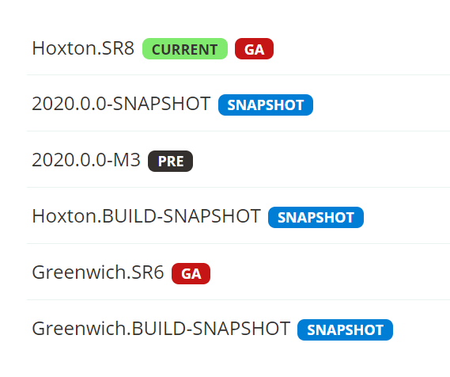

[TOC]

## Spring Cloud

### 一、系统架构的演变

#### 1. 集中式架构

当网站流量很小时，只需要一个应用，将所有的功能都部署在一起，以减少部署节点和成本。


- 优点：
  1. 系统开发快
  2. 维护成本低
  3. 适用于并发要求较低的系统
- 缺点
  1. 代码耦合度高，后期维护困难
  2. 无法针对不同模块进行优化
  3. 无法水平扩展
  4. 单点容错率低，并发能力差

#### 2. 垂直拆分

当访问量逐渐增大，单一应用无法满足需求，此时为了应对更高的并发和业务需求，我们根据业务功能对系统进行拆分：


- 优点：
  1. 系统拆分实现了流量分担，解决了并发问题
  2. 可以针对不同模块进行优化
  3. 方便水平扩展，负载均衡，容错率提高
- 缺点：
  1. 系统间相互独立，会有很多重复开发工作，影响开发效率

#### 3. 分布式

当垂直应用越来越多，应用之间交互不可避免，将核心业务抽取出来，作为独立的服务，逐渐形成稳定的服务中心，使前端应用能更快速的响应多变的市场需求。此时，用于提高业务复用及整合的分布式调用是关键。


- 优点：
  1. 将基础服务进行了抽取，系统间相互调用，提高了代码复用和开发效率
- 缺点：
  1. 系统耦合度变高
  2. 调用关系错综复杂，难以维护

#### 4. 服务治理（SOA）

SOA（Service Oriented Architecture）面向服务的架构：它是一种设计方法，其中包含多个服务， 服务之间通过相互依赖最终提供一系列的功能。一个服务通常以独立的形式存在于操作系统进程中。各个服务之间通过网络调用。


- 优点：
  1. 简单化系统的开发，部署较为灵活
  2. 更好的适应性和扩展性
  3. 高复用性
- 缺点：
  1. 每个供应商提供的ESB产品有偏差，自身实现较为复杂；
  2. 应用服务粒度较大，ESB集成整合所有服务和协议、数据转换使得运维、测试部署困难。
  3. 所有服务都通过一个通路通信，直接降低了通信速度。

#### 5. 微服务

微服务架构是使用一套小服务来开发单个应用的方式或途径，每个服务基于单一业务能力构建，运行在自己的进程中，并使用轻量级机制通信，通常是HTTP API，并能够通过自动化部署机制来独立部署。这些服务可以使用不同的编程语言实现，以及不同数据存储技术，并保持最低限度的集中式管理。


> API Gateway网关是一个服务器，是系统的唯一入口。网关提供RESTful/HTTP的方式访问服务。而服务端通过服务注册中心进行服务注册和管理。

- 特点：

  - 单一职责：微服务中每一个服务都对应唯一的业务能力，做到单一职责
  - 面向服务：面向服务是说每个服务都要对外暴露服务接口API。并不关心服务的技术实现，做到与平台和语言无关，也不限定用什么技术实现，只要提供REST的接口即可。
  - 自治：自治是说服务间互相独立，互不干扰
    - 团队独立：每个服务都是一个独立的开发团队。
    - 技术独立：因为是面向服务，提供REST接口，使用什么技术没有别人干涉。
    - 前后端分离：采用前后端分离开发，提供统一REST接口，后端不用再为PC、移动段开发不同接口。
    - 数据库分离：每个服务都使用自己的数据源。

- 微服务与SOA比较：

  | 功能     | SOA                  | 微服务                         |
  | -------- | -------------------- | ------------------------------ |
  | 组件大小 | 大块业务逻辑         | 单独任务或小块业务逻辑         |
  | 耦合     | 通常松耦合           | 总是松耦合                     |
  | 管理     | 着重中央管理         | 着重分散管理                   |
  | 目标     | 确保应用能够交互操作 | 易维护、易拓展、更轻量级的交互 |

### 二、远程调用方式

无论是微服务还是SOA，都面临着服务间的远程调用。那么服务间的远程调用方式有哪些呢？
常见的远程调用方式有以下几种：

- RPC：（Remote Procedure Call） 远程过程调用，类似的还有RMI。自定义数据格式，基于原生TCP通信，速度快，效率高。早期的Web Service，现在热门的Dubbo，都是RPC的典型。
- HTTP：HTTP其实是一种网络传输协议，基于TCP，规定了数据传输的格式。现在客户端浏览器与服务端通讯基本都是采用HTTP协议。也可以用来进行远程服务调用。缺点是消息封装臃肿。

#### 1. RPC

RPC，即 Remote Procedure Call（远程过程调用），是一个计算机通信协议。 该协议允许运行于一台计算机的程序调用另一台计算机的子程序，而程序员无需额外地为这个交互作用编程。

说得通俗一点就是：A计算机提供一个服务，B计算机可以像调用本地服务那样调用A计算机的服务。

**RPC调用流程图：**


#### 2. HTTP

HTTP其实是一种网络传输协议，基于TCP，工作在应用层，规定了数据传输的格式。现在客户端浏览器与服务端通信基本都是采用HTTP协议，也可以用来进行远程服务调用。缺点是消息封装臃肿，优势是对服务的提供和调用方没有任何技术限定，自由灵活，更符合微服务理念。现在热门的REST风格，就可以通过HTTP协议来实现。


#### 2. Http

#### 3. 如何选择？

RPC的机制是根据语言的API（language API）来定义的，而不是根据基于网络的应用来定义的。如果公司全部采用Java技术栈，那么使用Dubbo作为微服务架构是一个不错的选择。
相反，如果公司的技术栈多样化，而且你更青睐Spring家族，那么Spring Cloud搭建微服务是不二之选。会选择Spring Cloud套件，因此会使用HTTP方式来实现服务间调用。

### 三、Spring Cloud

#### 1. 简介

Spring Cloud是Spring旗下的项目之一，官网地址：[https://spring.io/projects/spring-cloud](https://spring.io/projects/spring-cloud)

Spring Cloud为开发者提供了快速构建分布式系统中一些常见模式的工具（如 configuration management（配置管理）、 service discovery（服务发现）、circuit breakers（断路器）、intelligent routing（智能路由）、micro-proxy（微代理）、control bus（控制总线）、 one-time tokens（一次性令牌）、global locks（全局锁）、leadership election（选举算法）、distributed sessions（分布式会话）、cluster state（集群状态））。

其主要涉及的组件包括：

- Eureka：注册中心
- Zuul：服务网关
- Ribbon：负载均衡
- Feign：服务调用
- Hystrix：熔断器

**架构图：**


#### 2. 版本

Spring Cloud的版本命名比较特殊，因为它不是一个组件，而是许多组件的集合，它的命名是以A到Z为首字母的一些单词组成(其实是伦敦地铁站的名字)：



**Spring Clound 和Spring Boot版本对应关系：**


这里我们使用Greenwich版本

### 四、微服务场景模拟

#### 1. 创建父工程

微服务中需要同时创建多个项目，先创建一个父工程，后续的工程都以这个工程为父，使用Maven的聚合和继承。统一管理子工程的版本和配置。

**导入依赖：**

```xml
<parent>
    <groupId>org.springframework.boot</groupId>
    <artifactId>spring-boot-starter-parent</artifactId>
    <version>2.1.5.RELEASE</version>
    <relativePath/>
</parent>

<properties>
    <java.version>1.8</java.version>
    <spring-cloud.version>Greenwich.SR1</spring-cloud.version>
    <mapper.starter.version>2.1.5</mapper.starter.version>
    <mysql.version>5.1.46</mysql.version>
</properties>

<dependencyManagement>
    <dependencies>
        <!-- springCloud -->
        <dependency>
            <groupId>org.springframework.cloud</groupId>
            <artifactId>spring-cloud-dependencies</artifactId>
            <version>${spring-cloud.version}</version>
            <type>pom</type>
            <scope>import</scope>
        </dependency>
        <!-- 通用Mapper启动器 -->
        <dependency>
            <groupId>tk.mybatis</groupId>
            <artifactId>mapper-spring-boot-starter</artifactId>
            <version>${mapper.starter.version}</version>
        </dependency>
        <!-- mysql驱动 -->
        <dependency>
            <groupId>mysql</groupId>
            <artifactId>mysql-connector-java</artifactId>
            <version>${mysql.version}</version>
        </dependency>
    </dependencies>
</dependencyManagement>
<dependencies>
    <dependency>
        <groupId>org.projectlombok</groupId>
        <artifactId>lombok</artifactId>
    </dependency>
</dependencies>
<build>
    <plugins>
        <plugin>
            <groupId>org.springframework.boot</groupId>
            <artifactId>spring-boot-maven-plugin</artifactId>
        </plugin>
    </plugins>
</build>
```

> 注意：
>
> 1. spring clound和spring boot 的版本对应 greenwich版本clound对应spring boot 2.1.x
> 2. 聚合父工程\<packaging>pom\</packaging>

#### 2. 服务提供者

新建一个项目，对外提供查询用户的服务。

1. 新建Module

   创建子工程user-service，导入依赖：

   ```xml
   <dependencies>
       <dependency>
           <groupId>org.springframework.boot</groupId>
           <artifactId>spring-boot-starter-web</artifactId>
       </dependency>
       <!-- 通用Mapper启动器 -->
       <dependency>
           <groupId>tk.mybatis</groupId>
           <artifactId>mapper-spring-boot-starter</artifactId>
       </dependency>
       <!-- mysql驱动 -->
       <dependency>
           <groupId>mysql</groupId>
           <artifactId>mysql-connector-java</artifactId>
       </dependency>
   </dependencies>
   ```

2. 编写配置文件

   创建`user-service\src\main\resources\application.yml`属性文件,这里我们采用了yaml语法

   ```yaml
   #设置服务端口
   server:
     port: 9091
   #配置数据库
   spring:
     datasource:
       driver-class-name: com.mysql.jdbc.Driver
       url: jdbc:mysql://localhost:3306/springclound
       username: root
       password: root
   #通用Mapper
   mybatis:
    type-aliases-package: com.yh.user.pojo
   ```

   ​

3. 启动并测试

#### 3. 服务调用者


### 五、Eureka注册中心

### 六、负载均衡Ribbon

###七、熔断器Hystrix

### 八、Feign

### 九、Spring Cloud GateWay网关

### 十、Spring Cloud Config分布式配置中心

### 十一、Spring Cloud Bus 服务总线


